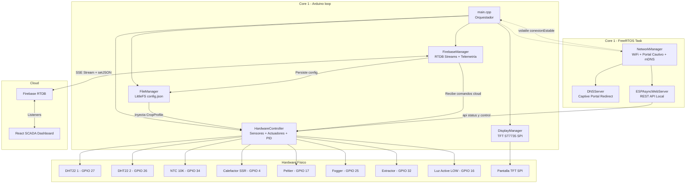

# 🔬 AUDITORÍA INTEGRAL — AgriEdge OS / Cámara Fungi Inteligente

> **Fecha:** 14 de Agosto de 2026  
> **Auditor:** Arquitecto de Software IoT Senior (AgroTech / Firmware Embebido / Lean Startup)  
> **Versión del Firmware:** v1.0.0 (Post-MVP)  
> **Archivos Analizados:** 12 archivos C++, 1 `platformio.ini`, 1 `.gitignore`, 74 informes históricos

---

## 📊 Scorecard Ejecutivo

| Área Auditada | Puntuación | Estado | Justificación Resumida |
| :--- | :---: | :---: | :--- |
| **Algoritmo de Control** | **6/10** | 🟡 | PID implementado pero desacoplado del ciclo; falta histéresis, árbitro de conflictos, y VPD no se usa en decisiones |
| **Arquitectura Agnóstica** | **9/10** | 🟢 | Desacoplamiento ejemplar. `config.json` con CropProfile inyectable. Cero reglas biológicas hardcodeadas en C++ |
| **Conectividad y Failsafe** | **8/10** | 🟢 | Portal Cautivo completo, Rescue AP, loop no-bloqueante. Falta backoff exponencial en Firebase y teardown OTA |
| **Memoria y Rendimiento** | **6/10** | 🟡 | Flash al 91.6% (165 KB libres). `DynamicJsonDocument` genera fragmentación. Librería huérfana `Ticker` |
| **Seguridad** | **5/10** | 🔴 | `Secrets.h` fue commiteado al historial Git. Password OTA hardcodeada. Sin watchdog de hardware activo |
| **Madurez Lean (MVP)** | **8/10** | 🟢 | MVP funcional en producción. 74 informes de sprint documentados. Hipótesis de valor validada |
| **PROMEDIO GENERAL** | **7.0/10** | 🟡 | **Producto sólido con deuda técnica gestionable. Priorizar seguridad y estabilidad del algoritmo** |

---

## 1. 🧠 Auditoría del Algoritmo de Control (El Cerebro)

### 1.1 Control PID — Time-Proportioning

El controlador PID está implementado con la librería `PID_v1` de Brett Beauregard para el calefactor (SSR):

| Parámetro | Valor | Archivo |
| :--- | :--- | :--- |
| $K_p$ | `2.0` | `HardwareController.cpp:3` |
| $K_i$ | `5.0` | `HardwareController.cpp:3` |
| $K_d$ | `1.0` | `HardwareController.cpp:3` |
| Ventana PWM | `5000 ms` (5 s) | `HardwareController.h:183` |
| Setpoint | `temp_ideal_min` del CropProfile | `HardwareController.cpp:265` |

> [!CAUTION]
> **BUG ARQUITECTÓNICO — PID Ineficaz por Desacople Temporal**
> 
> La función `procesarLogicaDeControl()` se invoca cada `INTERVALO_CICLO = 5000 ms` desde `main.cpp:184`. La ventana de Time-Proportioning también es de 5000 ms (`PID_WINDOW_SIZE`). Dado que la CPU solo evalúa `req_heater` una vez al inicio de cada ventana, **la modulación intraciclo es imposible**: el relé se comporta como ON/OFF binario cada 5 s, no como PWM proporcional. La solución es desacoplar el PID a una tarea FreeRTOS independiente evaluada cada 50-100 ms.

### 1.2 Histéresis

> [!WARNING]
> **NO EXISTE HISTÉRESIS EXPLÍCITA (Banda Muerta) en ningún actuador On/Off.**

En `HardwareController.cpp:277-316`:
- **Fogger:** Enciende en `hum <= hum_ideal_min`, apaga en `hum > hum_ideal_min` (umbral idéntico, Δ = 0).
- **Extractor por humedad:** Enciende en `hum >= hum_ideal_max`, apaga en `hum < hum_ideal_max`.
- **Cooler/Extractor por temperatura:** Enciende en `temp >= temp_ideal_max`, apaga al cruzar el umbral.

La estabilidad depende del filtro EWMA (α = 0.1) y del Anti-Short-Cycle de 3 minutos. El Peltier pasa `ignorarFiltro = true` en línea 333, quedando **sin protección anti-cycling**.

### 1.3 Manejo de Errores de Sensores

La fusión sensorial de redundancia dual es sólida (`HardwareController.cpp:125-137`):
- Si ambos DHTs son válidos → promedio.
- Si uno falla → se usa el superviviente.
- Si ambos fallan → `tempPromedio = -999.0f`.

> [!CAUTION]
> **BUG CRÍTICO — Safe Mode Inalcanzable ante Falla Total de Sensores**
> 
> Cuando ambos DHTs fallan, `tempPromedio = -999.0f`. Pero el filtro EWMA en línea 167 **omite la actualización** cuando detecta `-999.0f`, congelando `ewma_temp` en su último valor válido (ej. 23.4°C). La condición de Safe Mode en línea 247 evalúa `if (tempActual == -999.0f)`, pero `tempActual = ewma_temp` (que vale 23.4°C, no -999.0f). **El sistema nunca entra en Safe Mode y opera a ciegas con temperatura congelada.**

### 1.4 Conflictos de Actuadores

| Escenario | Resultado | Impacto |
| :--- | :--- | :--- |
| **Emergencia Térmica** (`temp >= temp_crit_max`) | Extractor + Cooler ON, Fogger **BLOQUEADO** | ✅ Correcto — Prioridad absoluta a extracción |
| **Demanda Normal de Frío** (`temp >= temp_ideal_max`) + **Humedad Baja** (`hum <= hum_ideal_min`) | Extractor ON + Fogger ON **simultáneamente** | 🔴 **CONFLICTO** — El extractor evacúa la niebla del fogger |
| **Demanda de Calor** (`temp <= temp_ideal_min`) + **Humedad Alta** (`hum >= hum_ideal_max`) | Heater ON + Extractor ON **simultáneamente** | ⚠️ El extractor evacúa el aire caliente |

### 1.5 Fórmula NTC

La implementación usa la **Ecuación Beta** (no Steinhart-Hart como dice el comentario en `HardwareController.h:32`):

$$\frac{1}{T} = \frac{1}{T_0} + \frac{1}{\beta} \ln\left(\frac{R}{R_0}\right)$$

Parámetros ($R_0 = 10\text{k}\Omega$, $\beta = 3950\text{K}$, $T_0 = 25°\text{C}$) son correctos para un NTC 10K B3950. Sin embargo, el ADC del ESP32 no usa calibración (`esp_adc_cal`) ni multisampling, generando un error de ±1.5°C a ±3°C.

### 1.6 VPD — Calculado pero Ignorado

El sistema calcula el VPD correctamente con la ecuación de Tetens en `HardwareController.cpp:181-185`, **pero nunca lo utiliza para tomar decisiones de control**. El control se basa exclusivamente en temperatura y humedad por separado.

### 1.7 Actuadores — Detalle Completo

| Actuador | Pin GPIO | Macro | Lógica Activa | Anti-Short-Cycle |
| :--- | :--- | :--- | :--- | :--- |
| Calefactor (SSR) | GPIO 4 | `PIN_HEATER` | HIGH | ❌ Exento (PID) |
| Enfriador Peltier | GPIO 17 | `PIN_COOLER` | HIGH | ❌ Exento |
| Humidificador (Fogger) | GPIO 25 | `PIN_FOGGER` | HIGH | ✅ 3 min |
| Extractor de Aire | GPIO 32 | `PIN_EXTRACTOR` | HIGH | ✅ 3 min |
| Iluminación | GPIO 16 | `PIN_LIGHT` | **LOW** (Activo en bajo) | ❌ Exento |

### 1.8 Sensores — Detalle Completo

| Sensor | Pin GPIO | Librería | Estado |
| :--- | :--- | :--- | :--- |
| DHT22 #1 | GPIO 27 | `DHTesp` | ✅ Operativo |
| DHT22 #2 | GPIO 26 | `DHTesp` | ✅ Operativo |
| NTC 10K (Sustrato) | GPIO 34 (ADC) | `analogRead` | ⚠️ Sin calibración ADC |
| CO2 | N/A | Hardcodeado | 🔴 Mock: `co2 = 400` fijo |

### 1.9 Filtro EWMA

- **Constante:** α = 0.1 (10% muestra actual, 90% historial).
- **Variables filtradas:** `ewma_temp`, `ewma_hum`, `ewma_sustrato`, `ewma_vpd`, `ewma_co2`.
- **Anti-sesgo inicial:** Primera muestra se asigna directamente (evita arrastre desde cero).
- **Cero `delay()`** en todo `HardwareController`. Toda temporización por `millis()`.

### 1.10 Magic Numbers Detectados

| Valor | Contexto | Refactorización Sugerida |
| :--- | :--- | :--- |
| `2.0, 5.0, 1.0` | Ganancias PID | `PID_DEFAULT_KP/KI/KD` o en `CropProfile` |
| `4095.0f` | Resolución ADC 12 bits | `ADC_MAX_RESOLUTION` |
| `273.15f` | Celsius a Kelvin | `ZERO_KELVIN_IN_CELSIUS` |
| `-999.0f` (×15) | Valor centinela de sensor inválido | `SENSOR_INVALID_VALUE` |
| `400` | CO2 base por defecto | `CO2_BASELINE_PPM` |
| `0.61078f, 17.27f, 237.3f` | Coeficientes de Tetens | Constantes con nombre |

---

## 2. 🏗️ Auditoría de Arquitectura Agnóstica

### 2.1 Desacoplamiento del `config.json`

**Veredicto: EXCELENTE (9/10).** El firmware es 100% agnóstico.

| Campo | Ejemplo Fungi | Ejemplo Invernadero |
| :--- | :--- | :--- |
| `kingdom` | `"FUNGI"` | `"PLANTAE"` |
| `temp_ideal_min` / `max` | 18.0 / 24.0 °C | 22.0 / 30.0 °C |
| `hum_ideal_min` / `max` | 85.0 / 95.0 % | 50.0 / 70.0 % |
| `co2_ideal_min` / `max` | 400 / 800 ppm | 400 / 1200 ppm |
| `light_hours_on` | 12 h | 18 h |
| `temp_sustrato_ideal` | 24.0 °C | 22.0 °C |

Cambiar de Fungi a Invernadero **no requiere recompilar C++**. Se envía un nuevo JSON vía Firebase RTDB.

### 2.2 Cascada de Fallback

1. Archivo no existe → `_crearConfiguracionPorDefecto()` genera perfil Fungi seguro.
2. Error al abrir → retorna configuración en memoria.
3. JSON corrupto → regenera defaults.
4. Campos faltantes → ArduinoJson usa operador coalescente `|`.

### 2.3 Diagrama de Componentes

---

## 3. 🔌 Auditoría de Conectividad y Failsafe

### 3.1 Portal Cautivo (Plug & Play)

**Veredicto: FUNCIONAL Y COMPLETO.**
1. Sin credenciales WiFi → SoftAP `SCADA_Node_XXXX` abierto.
2. DNS wildcard intercepta probes de Android (`/generate_204`), iOS y Windows.
3. Página HTML embebida en `PROGMEM` con pestañas de Control Local y Configuración WiFi.
4. `POST /guardar` → NVS `Preferences` → reboot limpio.

### 3.2 Modo Supervivencia (Edge Computing)

**Veredicto: ROBUSTO.** El `loop()` ejecuta incondicionalmente:
- `hw.leerSensores()` → siempre.
- `hw.procesarLogicaDeControl()` → siempre.
- `display.render()` → siempre.
- `firebase.publicarTelemetria()` → solo si `net.estaConectado()`.

Si WiFi falla >60s (12 reintentos × 5s), levanta un **Rescue AP** (`Fungi_Rescate_XXXX`) automáticamente.

### 3.3 Firebase

- **Autenticación:** Email/Password vía REST Auth.
- **Streams:** SSE bidireccional en `/devices/{deviceId}/commands`.
- **Telemetría Live:** Cada 5 s a `/telemetry/{deviceId}/data`.
- **Historial:** Cada 5 min a `/history/{deviceId}`.
- **Sin Backoff Exponencial:** Variable `_ultimoIntento` declarada pero **nunca usada**.

### 3.4 OTA — Causa Raíz del Bug "100% + Timeout"

El callback `onStart` en `main.cpp:154-156` **no detiene Firebase ni el WebServer**. Durante el flash, Firebase SSE y mbedTLS siguen consumiendo heap. Al 100%, la verificación de checksum compite con el tráfico de red, causando timeout.

### 3.5 mDNS

Configurado como `fungi.local` via `MDNS.begin("fungi")` en `NetworkManager.cpp:257`.

---

## 4. 💾 Auditoría de Memoria y Rendimiento

### 4.1 Flash — ¿Cabe OTA?

| Métrica | Valor |
| :--- | :--- |
| Esquema de particiones | `min_spiffs.csv` |
| Partición `app0` / `app1` | **1,966,080 bytes** (1.875 MiB) cada una |
| Binario actual (91.6%) | **~1,800,929 bytes** (1.717 MiB) |
| Margen restante | **~165,151 bytes** (161 KB, 8.4%) |
| Partición SPIFFS/LittleFS | 196,608 bytes (192 KB) |

**Respuesta: SÍ, OTA es físicamente posible** — el binario cabe en `app1`. Pero con solo 161 KB libres, cualquier nueva librería significativa causará desbordamiento.

### 4.2 Librería Huérfana

`sstaub/Ticker @ ^4.4.0` en `platformio.ini:9` **no se importa en ningún archivo fuente**. Peso muerto.

### 4.3 Dependencias Completas

| Librería | Estado | Veredicto |
| :--- | :--- | :--- |
| `sstaub/Ticker @ ^4.4.0` | **NO USADA** | ❌ Eliminar |
| `mobizt/Firebase ESP32 Client @ ^4.4.14` | Activa (núcleo cloud) | ✅ Esencial |
| `bblanchon/ArduinoJson @ ^6.21.3` | Activa (serialización) | ✅ Esencial |
| `beegee-tokyo/DHT sensor library for ESPx @ ^1.19` | Activa (sensores) | ✅ Esencial |
| `adafruit/Adafruit GFX Library @ ^1.11.9` | Activa (gráficos) | ✅ Esencial |
| `adafruit/Adafruit ST7735... @ ^1.10.4` | Activa (driver TFT) | ✅ Esencial |
| `mathieucarbou/ESPAsyncWebServer @ ^3.3.22` | Activa (portal cautivo) | ✅ Esencial |
| `br3ttb/PID @ ^1.2.1` | Activa (control térmico) | ✅ Esencial |

### 4.4 Fragmentación de Heap

| Fuente de Riesgo | Archivo | Tamaño |
| :--- | :--- | :--- |
| `DynamicJsonDocument` | `FirebaseManager.cpp:285` | 1024 B por stream event |
| `DynamicJsonDocument` ×3 | `FileManager.cpp:31,117,165` | 2048 B por operación |
| `String` concatenations | Múltiples archivos | Variable |

### 4.5 Código Bloqueante

- **`delay()` en todo el proyecto: 0 llamadas.** ✅
- **`vTaskDelay()`: Solo en `NetworkManager`** (su propio hilo FreeRTOS). ✅
- **Riesgo:** `Firebase.setJSON()` y `Firebase.pushJSON()` son llamadas HTTP síncronas TLS en el hilo principal.

### 4.6 Display TFT

- **Controlador:** ST7735 (160×128 px, Landscape).
- **Pines:** CS: GPIO 5, DC: GPIO 14, RST: GPIO 13 (SPI VSPI).
- **Parpadeo:** `fillScreen(BLACK)` en cada `render()`. Sin dirty checking ni sprites.
- **Bloqueo:** ~20-40 ms por render (cada 5 s). Aceptable.

---

## 5. 🔒 Auditoría de Seguridad

| Hallazgo | Severidad | Estado |
| :--- | :--- | :--- |
| `Secrets.h` en `.gitignore` del workspace | — | ✅ Incluido en línea 9 |
| `Secrets.h` **commiteado en historial Git previo** | 🔴 CRÍTICA | Credenciales expuestas |
| Password OTA hardcodeada (`agriedge2026`) | ⚠️ MEDIA | En `main.cpp:151` y `platformio.ini:23` |
| Watchdog de Hardware (`esp_task_wdt`) | 🔴 CRÍTICA | Config existe pero NO conectado a API ESP32 |
| WiFi credenciales | — | ✅ En NVS dinámico vía Portal Cautivo |
| ArduinoOTA con password | — | ✅ Protegido (`agriedge2026`) |

### Credenciales en `Secrets.h`
1. `FIREBASE_API_KEY` — Google Web API Key
2. `FIREBASE_DATABASE_URL` — URL pública del endpoint RTDB
3. `FIREBASE_USER_EMAIL` — Email de cuenta Firebase Auth
4. `FIREBASE_USER_PASSWORD` — Password en texto plano

### Escritura No Atómica en LittleFS
`FileManager.cpp:147-159` abre con `"w"` (trunca a 0 bytes). Si hay corte de energía durante `serializeJson`, el archivo queda corrupto. Mitigación: el parser regenera defaults, pero se pierden las configuraciones personalizadas.

---

## 6. 📉 Auditoría Lean Startup

### 6.1 Hipótesis de Valor
> *"Un cultivador de hongos puede controlar automáticamente el microclima de su cámara de fructificación desde cualquier lugar del mundo, sin conocimientos técnicos, con un dispositivo que se configura solo (Plug & Play) y sobrevive cortes de internet."*

**Estado: VALIDADA.** El sistema opera en producción real.

### 6.2 Waste (Desperdicio)
| Elemento | Veredicto |
| :--- | :--- |
| Librería `Ticker` | ❌ Eliminar — peso muerto |
| Campo `co2_ppm` hardcodeado a 400 | ⚠️ Aceptable como placeholder |
| Display TFT ST7735 | ✅ Útil para diagnóstico local |
| 74 informes de sprint | ⚠️ Consolidar en Engineering Journal |

### 6.3 Readiness para Beta
- ✅ Plug & Play funcional (Portal Cautivo).
- ✅ Control autónomo offline.
- ✅ Dashboard SCADA profesional.
- ❌ Bug de Safe Mode (calefactor opera a ciegas si ambos DHTs fallan).
- ❌ Sin notificaciones push.
- ❌ Credenciales expuestas en historial Git.

### 6.4 Veredicto: PERSEVERAR

La arquitectura agnóstica es la pieza más valiosa. Los problemas son deuda técnica corregible, no defectos arquitectónicos. La base es sólida para escalar a múltiples verticales (Fungi → Plantae → Cannabis → Acuaponía).

---

## 📋 Tabla de Deuda Técnica

| # | Problema | Archivo / Función | Severidad | Impacto si no se corrige |
| :--- | :--- | :--- | :---: | :--- |
| 1 | **Safe Mode inalcanzable** — EWMA congela temp al fallar ambos DHTs | `HardwareController.cpp:167,247` | 🔴 | Calefactor opera a ciegas. Riesgo de incendio |
| 2 | **Credenciales en historial Git** | `.git` history | 🔴 | API Key y password expuestas |
| 3 | **Watchdog inactivo** — Config existe pero `esp_task_wdt` no inicializado | `main.cpp` | 🔴 | Bloqueo SSL deja al ESP32 colgado |
| 4 | **PID desacoplado del ciclo** — Ventana PWM = Intervalo de evaluación | `HardwareController.cpp:264-271` + `main.cpp:70` | 🟡 | PID degrada a On/Off binario |
| 5 | **Conflicto Extractor ↔ Fogger** — Sin árbitro de actuadores | `HardwareController.cpp:291-311` | 🟡 | Desperdicio energético e hídrico |
| 6 | **Sin histéresis** — Umbrales simétricos sin banda muerta | `HardwareController.cpp:277-316` | 🟡 | Relay chatter mitigado solo por EWMA |
| 7 | **Peltier sin anti-short-cycle** — `ignorarFiltro = true` | `HardwareController.cpp:333` | 🟡 | Degradación del módulo Peltier |
| 8 | **OTA falla al 100%** — `onStart` no detiene Firebase/WebServer | `main.cpp:154-156` | 🟡 | No se puede actualizar por WiFi |
| 9 | **Sin backoff exponencial** — Firebase reintenta sin pausa | `FirebaseManager.cpp:39-57` | 🟡 | Flood de conexiones TLS |
| 10 | **`DynamicJsonDocument`** — Fragmentación de heap | `FirebaseManager.cpp:285`, `FileManager.cpp:31,117,165` | 🟡 | Crash por heap exhaustion |
| 11 | **ADC sin calibración** — Error ±1.5°C a ±3°C en NTC | `HardwareController.cpp:114-119` | 🟡 | Lectura imprecisa de sustrato |
| 12 | **CO2 hardcodeado** — 400 ppm fijo sin sensor | `HardwareController.cpp:146-147` | 🟡 | Dashboard muestra dato falso |
| 13 | **VPD calculado pero no usado** | `HardwareController.cpp:181-185` | 🟢 | Oportunidad perdida de control avanzado |
| 14 | **Escritura no atómica en LittleFS** | `FileManager.cpp:147-159` | 🟢 | Corte de energía → config corrupto |
| 15 | **Pantalla TFT con `fillScreen(BLACK)`** | `DisplayManager.cpp:44` | 🟢 | Parpadeo estético cada 5 s |
| 16 | **Librería `Ticker` huérfana** | `platformio.ini:9` | 🟢 | Peso muerto en flash |
| 17 | **Magic Numbers** — PID gains, -999.0f, coeficientes Tetens | Múltiples archivos | 🟢 | Mantenibilidad reducida |
| 18 | **Password OTA hardcodeada** | `main.cpp:151` | 🟢 | Extraer a `Secrets.h` |

---

## 🚀 Plan de Acción Priorizado

### 🔴 Sprint Inmediato — Deuda Crítica

| # | Tarea | Archivos | Esfuerzo |
| :--- | :--- | :--- | :--- |
| 1 | **Corregir bug de Safe Mode:** Cuando ambos DHTs fallen, forzar `ewma_temp = -999.0f` para activar Safe Mode | `HardwareController.cpp` | ~2h |
| 2 | **Activar Watchdog de Hardware:** Conectar `watchdog_timeout_ms` a `esp_task_wdt_init()` + reset en `loop()` | `main.cpp` | ~1h |
| 3 | **Rotar credenciales de Firebase:** Regenerar API Key, cambiar password. Purgar `Secrets.h` del historial Git | `.git`, Firebase Console | ~2h |

### 🟡 Sprint Siguiente — Core MVP Estable

| # | Tarea | Archivos | Esfuerzo |
| :--- | :--- | :--- | :--- |
| 4 | **Desacoplar PID a tarea FreeRTOS** evaluando SSR cada 50-100 ms | `main.cpp`, `HardwareController.cpp` | ~4h |
| 5 | **Implementar Árbitro de Actuadores** — Matriz de exclusión mutua | `HardwareController.cpp` | ~3h |
| 6 | **Implementar Histéresis paramétrica** en `CropProfile` | `FileManager.h`, `HardwareController.cpp` | ~2h |
| 7 | **Fix OTA:** Detener Firebase y WebServer en `onStart()` | `main.cpp`, `FirebaseManager.cpp` | ~2h |
| 8 | **Migrar a `StaticJsonDocument`** y eliminar `Ticker` | `FirebaseManager.cpp`, `FileManager.cpp`, `platformio.ini` | ~2h |

### 🟢 Sprint Futuro — Escalabilidad

| # | Tarea | Archivos | Esfuerzo |
| :--- | :--- | :--- | :--- |
| 9 | **Control basado en VPD** como variable maestra | `HardwareController.cpp` | ~6h |
| 10 | **Calibración ADC + Multisampling NTC** | `HardwareController.cpp` | ~3h |
| 11 | **Notificaciones Push (FCM / Telegram)** | Cloud Functions, React | ~8h |
| 12 | **Crop Steering Dinámico** — Transiciones graduales de setpoints | React, Firebase RTDB | ~8h |
| 13 | **Sensor CO2 NDIR real** (SCD30/SCD40/MH-Z19) | `HardwareController.cpp/.h` | ~4h |

---

## 🏛️ Veredicto Final

El proyecto AgriEdge OS demuestra una **arquitectura fundamentalmente sólida** para un sistema IoT industrial en AgroTech. El desacoplamiento agnóstico (9/10) es la joya de la corona. El modo de supervivencia offline es robusto y el Portal Cautivo Plug & Play es completo.

Los problemas encontrados son **deuda técnica acumulada por la velocidad del MVP**, no defectos de diseño. El hallazgo más grave es el **bug de Safe Mode** (#1): si ambos sensores de temperatura fallan, el calefactor sigue operando con la última lectura congelada indefinidamente. Esto es un riesgo de seguridad física.

**Primera acción inmediata:** Corregir el bug de Safe Mode en `HardwareController.cpp` (2 horas de trabajo). Es la única corrección que separa a este sistema de ser un producto beta seguro de ser un riesgo de incendio.
