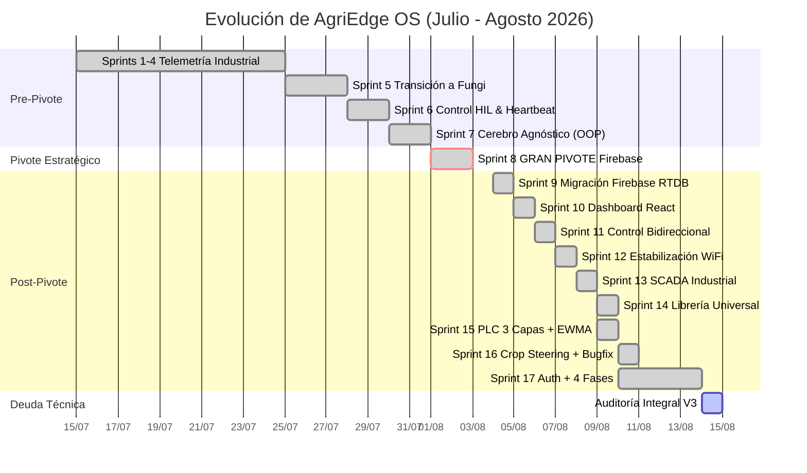
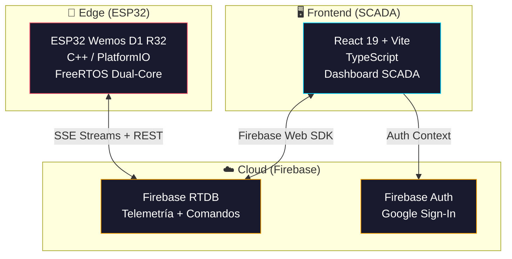

# 📋 INFORME MAESTRO — AgriEdge OS
## Sistema SCADA IoT Agronómico Agnóstico — Cámara Fungi Inteligente

> **Versión:** 1.0.0 (MVP Consolidado)  
> **Fecha de Consolidación:** 14 de Agosto de 2026  
> **Última Auditoría Técnica:** V3 — 14/08/2026 ([ver auditoría completa](./AUDITORIA_INTEGRAL_V3_2026-08-14.md))  
> **Autor del Informe:** Generado por IA a partir de 128 documentos históricos (74 informes + 3 docs + 2 documentación + 49 artifacts)

---

## 1. Resumen Ejecutivo

**AgriEdge OS** es un ecosistema IoT de grado industrial para el control automático de microclimas en ambientes agrícolas controlados (CEA — *Controlled Environment Agriculture*). El sistema opera como un **PLC agnóstico**: el firmware C++ del ESP32 no contiene reglas biológicas hardcodeadas; un archivo de configuración JSON define el perfil de cultivo. Cambiar de Hongos a Tomates **no requiere recompilar C++**.

### Visión del Producto
Construir el mejor algoritmo y producto comercial de control de cultivos, comenzando por **Fungi como primer vertical** (Lean Startup). El sistema cumple 4 pilares innegociables:

1. **Motor Agnóstico:** Perfiles JSON inyectables por especie (20 especies: 10 Fungi + 10 Plantae).
2. **Tolerancia a Fallos:** Edge Computing local si WiFi muere + AP de Rescate automático.
3. **Conectividad Directa a Firebase:** Sin intermediarios (MQTT/Node.js eliminados).
4. **Plug & Play:** Portal Cautivo para configuración WiFi sin conocimientos técnicos.

### Estado Actual

| Métrica | Valor |
| :--- | :--- |
| **Puntuación de Auditoría** | 7.0/10 |
| **Sprints Completados** | 17 |
| **Perfiles Biológicos** | 20 (10 Fungi + 10 Plantae) |
| **Fases Fenológicas** | 4 por especie (estándar universal) |
| **Sensores Activos** | DHT22 ×2 (redundancia) + NTC 10K (sustrato) |
| **Actuadores** | 5 (Calefactor SSR, Peltier, Fogger, Extractor, Luz) |
| **Costo Operativo Cloud** | **$0** (Firebase Free Tier) |
| **Bugs Críticos Conocidos** | 3 (Safe Mode, Watchdog, Credenciales Git) |

---

## 2. Cronología del Proyecto

### 2.1 Timeline Completa



### 2.2 Detalle por Sprint

| Sprint | Fecha | Entregables Clave | Pivotes |
| :--- | :--- | :--- | :--- |
| **1-4** | Jul 2026 | Monitoreo ESP32 + DHT22 + KY-002. Backend Node.js + MQTT (HiveMQ) + InfluxDB Cloud. API REST Express | Enfoque inicial: mantenimiento predictivo industrial |
| **5** | ~25 Jul | Transición a "Cámara Fungi Inteligente". Frontend React con Glassmorphism. Identidad por MAC Address | **PIVOTE DE DOMINIO:** De telemetría mecánica a control ambiental fungi |
| **6** | ~28 Jul | Control Hardware-in-the-Loop. Reverse Heartbeat (watchdog 35s). Null-Safety en sensores | Control bidireccional MQTT con interlocks |
| **7** | ~30 Jul | Refactorización OOP de monolito (486→87 líneas `main.cpp`). 5 módulos desacoplados | Demolición del "God Object" |
| **8** | 1-3 Ago | **EL GRAN PIVOTE:** Eliminación de MQTT + Node.js + InfluxDB. Portal Cautivo Async. LittleFS. Dual-Core FreeRTOS | **PIVOTE TOTAL:** Stack Serverless $0. Firebase RTDB directo |
| **9** | 4-5 Ago | `FirebaseManager` con Auth + Streams SSE. `Secrets.h` para API Keys | ESP32 habla directamente con Google Cloud |
| **10** | 5-6 Ago | Dashboard React + Firebase Web SDK. Telemetría en vivo. Comandos manuales | React consume RTDB sin intermediarios |
| **11** | 6-7 Ago | Control bidireccional (stream dedicado). Panel de diagnóstico offline. Git sync | Separación de tuberías upload/download en ESP32 |
| **12** | 7-8 Ago | Estabilización WiFi (*Leaky Bucket*). Modos AUTO/MANUAL con interlocks. Gráficos Recharts | Seguridad del cultivo prevalece sobre comandos remotos |
| **13** | 8-9 Ago | Motor de Reglas Declarativo. SCADA ISA-95. Semáforo de Estabilidad. Retención 30 días | Reglas JSON inyectables dinámicamente |
| **14** | 9 Ago | 10 perfiles biológicos (5 Fungi + 5 Plantae). Enciclopedia Agronómica 2.0. Wizard multi-paso | Biología en React; ESP32 ejecuta setpoints |
| **15** | 9-10 Ago | **PLC de 3 Capas** con Árbitro de Conflictos. Filtro EWMA (α=0.1). Anti-Short-Cycle (180s) | **PIVOTE INTERNO:** De reglas declarativas a autómata determinista |
| **16** | 10 Ago | Crop Steering Dinámico V2 (interpolación LINEAR/STEP). Corrección de 6 bugs frontend | Transiciones graduales de setpoints |
| **17** | 10-14 Ago | 4 Fases Fenológicas universales. 20 especies. Firebase Auth. Security Rules RTDB | Estandarización biológica final |

### 2.3 Los 4 Pivotes Fundamentales

1. **Pivote de Dominio (Sprint 5):** De telemetría industrial (cintas transportadoras) a control climático agrícola (Cámara Fungi).
2. **Pivote de Arquitectura (Sprint 8):** De stack cloud tradicional (MQTT + Node.js + InfluxDB, costo mensual) a Firebase RTDB Serverless ($0).
3. **Pivote de Control (Sprint 15):** De motor de reglas declarativas (oscilaciones y conflictos) a PLC determinista con Árbitro de Conflictos.
4. **Pivote Agronómico (Sprint 17):** Estandarización de 5 a 4 fases fenológicas universales con investigación científica rigurosa (20 especies).

---

## 3. Stack Tecnológico

### 3.1 Resumen del Stack



### 3.2 Tabla de Tecnologías

| Capa | Tecnología | Versión / Detalle | Propósito |
| :--- | :--- | :--- | :--- |
| **Edge** | ESP32 Wemos D1 R32 | Xtensa Dual-Core 240 MHz | Microcontrolador principal |
| | PlatformIO + Arduino Core | `espressif32` | Toolchain de compilación |
| | FreeRTOS | Nativo ESP-IDF | Concurrencia Dual-Core |
| | LittleFS | Partición 192 KB | Almacenamiento no volátil (`config.json`) |
| | ArduinoJson | v6.21.3 | Serialización/deserialización JSON |
| | DHTesp | v1.19 | Driver sensores DHT22 |
| | PID_v1 | v1.2.1 | Control PID Time-Proportioning |
| | Adafruit ST7735 | v1.10.4 | Driver pantalla TFT SPI |
| | ESPAsyncWebServer | v3.3.22 | Portal Cautivo + API REST local |
| | Firebase ESP32 Client | v4.4.14 | Comunicación directa con RTDB |
| **Cloud** | Firebase RTDB | Free Tier (1 GB almac., 10 GB/mes) | Base de datos en tiempo real |
| | Firebase Auth | Email/Password + Google | Autenticación de usuarios |
| **Frontend** | React | v19 | Framework UI |
| | Vite | Latest | Bundler / Dev Server |
| | TypeScript | Estricto | Tipado fuerte |
| | Recharts | Latest | Gráficos históricos (30 días) |
| | Lucide Icons | Latest | Iconografía SCADA |

### 3.3 Tecnologías Eliminadas (Legacy)

| Tecnología | Sprint de Eliminación | Razón |
| :--- | :--- | :--- |
| MQTT (HiveMQ) | Sprint 8 | Intermediario innecesario. Costo mensual |
| Node.js Backend | Sprint 8 | Servidor 24/7 eliminado. $0 burn rate |
| InfluxDB Cloud | Sprint 8 | Reemplazado por Firebase RTDB historial |
| Tailwind CSS v4 | Sprint 10+ | Reemplazado por CSS vanilla / diseño custom |
| Motor de Reglas Declarativas | Sprint 15 | Oscilaciones impredecibles. Reemplazado por PLC |

---

## 4. Arquitectura Actual

### 4.1 Diagrama de Componentes

```mermaid
graph TD
    subgraph "Core 1 — Arduino loop() [No bloqueante]"
        MAIN["main.cpp<br/>Orquestador (87 líneas)"]
        HW["HardwareController<br/>Sensores + Actuadores + PID<br/>+ Árbitro de Conflictos"]
        FM["FileManager<br/>LittleFS config.json<br/>+ CropProfile Parser"]
        FB["FirebaseManager<br/>RTDB Auth + Streams<br/>+ Telemetría"]
        DISP["DisplayManager<br/>TFT ST7735 SPI<br/>+ Dirty Checking"]
    end

    subgraph "Core 0 — FreeRTOS Task"
        NET["NetworkManager<br/>WiFi STA + SoftAP<br/>+ Portal Cautivo + mDNS"]
        DNS["DNSServer<br/>Redirect DNS Wildcard"]
        WEB["ESPAsyncWebServer<br/>REST API Local + OTA"]
    end

    subgraph "☁️ Firebase"
        RTDB["Realtime Database"]
        AUTH_F["Firebase Auth"]
    end

    subgraph "🖥️ React SCADA Dashboard"
        APP["App.tsx — Orquestador UI"]
        TELE["TelemetryDashboard<br/>Métricas en vivo + Recharts"]
        CROP["CropProfiles.ts<br/>20 especies + 4 fases"]
        STEER["SteeringEngine.ts<br/>Crop Steering dinámico"]
        PROFILE["ProfileManager.tsx<br/>Gestor + Enciclopedia"]
    end

    subgraph "🔌 Hardware Físico"
        DHT1["DHT22 #1 — GPIO 27"]
        DHT2["DHT22 #2 — GPIO 26"]
        NTC["NTC 10K Sustrato — GPIO 34 ADC"]
        HEAT["Calefactor SSR — GPIO 4"]
        COOL["Peltier — GPIO 17"]
        FOG["Fogger — GPIO 25"]
        EXT["Extractor — GPIO 32"]
        LUZ["Luz Active LOW — GPIO 16"]
        TFT["Pantalla TFT 160×128 SPI"]
    end

    MAIN --> HW
    MAIN --> FM
    MAIN --> FB
    MAIN --> DISP
    MAIN -.->|volatile| NET

    HW --> DHT1 & DHT2 & NTC
    HW --> HEAT & COOL & FOG & EXT & LUZ
    DISP --> TFT

    FB <-->|SSE Stream + setJSON| RTDB
    FB -->|JWT Auth| AUTH_F

    APP <-->|Firebase Web SDK onValue| RTDB
    APP --> TELE & CROP & STEER & PROFILE

    FM -->|Inyecta CropProfile| HW
    FB -->|Recibe comandos| HW
    FB -->|Persiste config| FM

    NET --> DNS & WEB
    WEB -->|/api/status /api/control| HW
```



### 4.2 Modelo de Datos Firebase RTDB

```
firebase-rtdb/
├── telemetry/
│   └── {deviceId}/
│       └── data/                    ← Telemetría live (cada 5s)
│           ├── temp1, temp2         ← Temperaturas individuales DHT22
│           ├── tempPromedio         ← Fusión redundante
│           ├── humidity             ← Humedad relativa %
│           ├── vpd                  ← Déficit de Presión de Vapor (kPa)
│           ├── sustrato             ← Temperatura sustrato NTC (°C)
│           ├── co2_ppm             ← CO2 (placeholder: 400 ppm)
│           ├── estado_operacional   ← NORMAL|CALENTANDO|ENFRIANDO|SAFE_MODE|EMERGENCIA
│           ├── heater, cooler...    ← Estado booleano de actuadores
│           └── modo                 ← AUTO|MANUAL
│
├── history/
│   └── {deviceId}/
│       └── {pushId}/               ← Snapshots cada 5 min (retención 30 días)
│
├── devices/
│   └── {deviceId}/
│       └── commands/                ← Comandos del dashboard → ESP32
│           ├── heater: true/false
│           ├── cooler: true/false
│           ├── fogger: true/false
│           ├── extractor: true/false
│           ├── light: true/false
│           ├── modo: "AUTO"/"MANUAL"
│           └── crop/                ← CropProfile inyectado
│
└── users/                           ← Firebase Auth metadata
```

### 4.3 Mapeo de Hardware (GPIO)

| Componente | GPIO | Tipo | Lógica Activa | Protección |
| :--- | :---: | :--- | :---: | :--- |
| DHT22 #1 (Ambiente) | 27 | Digital In | — | Redundancia dual |
| DHT22 #2 (Ambiente) | 26 | Digital In | — | Redundancia dual |
| NTC 10K (Sustrato) | 34 | ADC In | — | Ecuación Beta (β=3950) |
| Calefactor SSR | 4 | Digital Out | HIGH | PID Time-Proportioning |
| Enfriador Peltier | 17 | Digital Out | HIGH | Sin anti-short-cycle (⚠️) |
| Humidificador Fogger | 25 | Digital Out | HIGH | Anti-Short-Cycle 180s |
| Extractor de Aire | 32 | Digital Out | HIGH | Anti-Short-Cycle 180s |
| Iluminación | 16 | Digital Out | **LOW** | Conmutación instantánea |
| TFT CS | 5 | SPI | — | — |
| TFT DC | 14 | SPI | — | — |
| TFT RST | 13 | SPI | — | — |

### 4.4 Algoritmos de Control

#### Filtro EWMA

$$\text{ewma}_{t} = \alpha \cdot x_{t} + (1 - \alpha) \cdot \text{ewma}_{t-1}$$

Con $\alpha = 0.1$ (10% muestra actual, 90% historial). Aplicado a: temperatura, humedad, sustrato, VPD, CO2. Evaluado cada 5 segundos.

#### Control PID (Calefactor)

Control Time-Proportioning con ventana de 5000 ms. Ganancias: $K_p = 2.0$, $K_i = 5.0$, $K_d = 1.0$. Setpoint = `temp_ideal_min` del CropProfile.

> ⚠️ **Deuda Técnica:** La ventana PID (5s) coincide con el intervalo de evaluación (5s), degradando el PID a On/Off binario.

#### Árbitro de Conflictos (Prioridad Descendente)

1. **P1 — Supervivencia Térmica:** `Temp > temp_crit_max` o `CO2 > co2_crit_max` → Fuerza Extractor ON, bloquea Calefactor y Fogger.
2. **P2 — Emergencia Sustrato:** `Sustrato > 28°C` → Fuerza Extractor ON, bloquea Calefactor. `Sustrato < 15°C` → Fuerza Calefactor ON, bloquea Extractor.
3. **P3 — Protección Frío:** `Temp < temp_ideal_min` → Calefactor ON, Extractor OFF (salvo P1).
4. **P4 — Control Normal:** Humidificador, Extractor, Cooler operan dentro de rangos `ideal_min/max`.

#### Fórmula VPD (Tetens)

$$\text{SVP} = 0.61078 \times e^{\frac{17.27 \times T}{237.3 + T}}$$

$$\text{VPD} = \text{SVP} \times \left(1 - \frac{\text{RH}}{100}\right)$$

> ⚠️ **Deuda Técnica:** VPD se calcula y reporta en telemetría pero **no se usa para decisiones de control**.

---

## 5. Decisiones Arquitectónicas (ADRs)

### ADR-001: Eliminación de MQTT — Pivote a Firebase RTDB (Sprint 8)
- **Contexto:** El stack MQTT + Node.js + InfluxDB tenía costo mensual fijo y un servidor 24/7 como punto único de fallo.
- **Decisión:** Conectar el ESP32 directamente a Firebase RTDB vía SDK nativo (SSE + REST).
- **Consecuencias:** $0 costo operativo. Latencia reducida. Sin servidor intermediario.

### ADR-002: Motor Agnóstico — CropProfile JSON Inyectable (Sprint 8)
- **Contexto:** Las reglas biológicas estaban hardcodeadas en C++ (`if temperatura > 26...`).
- **Decisión:** Externalizar toda la biología a un JSON (`CropProfile`) con campos: `temp_ideal_min/max`, `hum_ideal_min/max`, `co2_ideal_min/max`, `light_hours_on`, etc.
- **Consecuencias:** Cambiar de cultivo no requiere recompilar. El ESP32 es un PLC stateless.

### ADR-003: PLC Determinista vs Motor de Reglas (Sprint 15)
- **Contexto:** El motor de reglas declarativas (`IF sensor > X THEN actuador ON`) causaba oscilaciones y conflictos (extractor vs fogger simultáneos).
- **Decisión:** Reemplazar por Árbitro de Conflictos con prioridades fijas + FSM (`EstadoOperacional`) + Anti-Short-Cycle (180s).
- **Consecuencias:** Control determinista y predecible. Sin conflictos de actuadores.

### ADR-004: Crop Steering Agnóstico — 4 Fases Universales (Sprint 17)
- **Contexto:** 5 fases fenológicas eran inconsistentes entre Fungi y Plantae.
- **Decisión:** Estandarizar a 4 fases universales con interpolación lineal de setpoints entre transiciones.
- **Consecuencias:** Fungi: Incubación → Inducción → Fructificación → Descanso. Plantae: Germinación → Vegetativo → Floración → Maduración.

---

## 6. Investigación Agronómica

### 6.1 Parámetros por Especie — Reino Fungi

| Especie | Fase | Temp Aire (°C) | Temp Sustrato (°C) | RH (%) | CO2 (ppm) | Luz (h) |
| :--- | :--- | :---: | :---: | :---: | :---: | :---: |
| *Pleurotus ostreatus* | Incubación | 24 | 26-28 | 75-85 | 5000-20000 | 0 |
| | Pinning | 10-15 (shock) | 15-18 | 95-100 | <1000 | 12 |
| | Fructificación | 15-21 | 18-22 | 85-90 | <800 | 12 |
| *Psilocybe cubensis* | Incubación | 21-24 | 24-28 | 85-95 | 5000-10000 | 0 |
| | Pinning | 20-22 | 21-23 | 95-100 | <800 | 12 |
| | Fructificación | 22-25 | 23-26 | 85-90 | <800 | 12 |
| *Hericium erinaceus* | Fructificación | 15-20 | 18-22 | 90-95 | <500 | 12 |
| *Lentinula edodes* | Fructificación | 10-20 | 15-22 | 80-90 | <1000 | 12 |
| *Ganoderma lucidum* | Antler | 25-30 | 28-32 | 90-95 | 2000-5000 | 0 |
| | Conk | 25-30 | 28-32 | 90-95 | <1000 | 12 |

### 6.2 Parámetros por Especie — Reino Plantae

| Especie | Fase | VPD (kPa) | Temp (°C) | RH (%) | CO2 (ppm) | DLI |
| :--- | :--- | :---: | :---: | :---: | :---: | :---: |
| *Cannabis sativa* | Vegetativo | 0.8-1.1 | 22-28 | 55-70 | 1000-1500 | 35-45 |
| | Floración tardía | 1.4-1.6 | 20-26 | 40-45 | 1000-1500 | 40-50 |
| *Solanum lycopersicum* | Vegetativo | 0.8-1.0 | 22-28 | 60-70 | 800-1200 | 20-30 |
| | Floración | 1.0-1.2 | 20-26 | 55-65 | 800-1200 | 25-35 |
| *Lactuca sativa* | Vegetativo | 0.5-0.8 | 18-22 | 65-75 | 800-1200 | 12-17 |
| *Fragaria × ananassa* | Fructificación | 0.8-1.0 | 18-24 (noche: 12-14) | 60-75 | 800-1000 | 20-30 |

### 6.3 Principio de Termogénesis (Fungi)

> **Clave para el control:** Durante la colonización activa, la digestión celular del micelio genera calor metabólico constante, elevando el núcleo del sustrato **+2°C a +5°C** por encima del aire ambiental. El aire debe mantenerse más frío que el objetivo del sustrato para evitar invasión bacteriana (*Bacillus spp.*) por encima de 30°C.

---

## 7. Auditoría Técnica (Resumen V3)

> 📄 **Documento completo:** [`AUDITORIA_INTEGRAL_V3_2026-08-14.md`](./AUDITORIA_INTEGRAL_V3_2026-08-14.md)

### 7.1 Scorecard

| Área | Puntuación | Estado |
| :--- | :---: | :---: |
| Algoritmo de Control | 6/10 | 🟡 |
| Arquitectura Agnóstica | 9/10 | 🟢 |
| Conectividad y Failsafe | 8/10 | 🟢 |
| Memoria y Rendimiento | 6/10 | 🟡 |
| Seguridad | 5/10 | 🔴 |
| Madurez Lean (MVP) | 8/10 | 🟢 |
| **PROMEDIO** | **7.0/10** | 🟡 |

### 7.2 Top 5 Hallazgos Críticos

| # | Problema | Severidad | Impacto |
| :--- | :--- | :---: | :--- |
| 1 | **Safe Mode inalcanzable** — EWMA congela temperatura al fallar ambos DHTs | 🔴 | Calefactor opera a ciegas. Riesgo de incendio |
| 2 | **Credenciales en historial Git** — `Secrets.h` fue commiteado | 🔴 | API Key y password expuestas |
| 3 | **Watchdog inactivo** — `esp_task_wdt` no inicializado | 🔴 | Bloqueo SSL deja al ESP32 colgado |
| 4 | **PID desacoplado del ciclo** — Degrada a On/Off binario | 🟡 | Control térmico subóptimo |
| 5 | **Conflicto Extractor ↔ Fogger** — Sin exclusión mutua | 🟡 | Desperdicio energético e hídrico |

---

## 8. Deuda Técnica Completa

| # | Problema | Severidad | Sprint Sugerido |
| :--- | :--- | :---: | :--- |
| 1 | Safe Mode inalcanzable (EWMA congela temp) | 🔴 | Inmediato |
| 2 | Credenciales en historial Git | 🔴 | Inmediato |
| 3 | Watchdog inactivo | 🔴 | Inmediato |
| 4 | PID desacoplado del ciclo (5s = ventana) | 🟡 | Siguiente |
| 5 | Conflicto Extractor ↔ Fogger | 🟡 | Siguiente |
| 6 | Sin histéresis (banda muerta = 0) | 🟡 | Siguiente |
| 7 | Peltier sin anti-short-cycle | 🟡 | Siguiente |
| 8 | OTA falla al 100% (Firebase no se detiene) | 🟡 | Siguiente |
| 9 | Sin backoff exponencial en Firebase | 🟡 | Siguiente |
| 10 | `DynamicJsonDocument` fragmenta heap | 🟡 | Siguiente |
| 11 | ADC sin calibración (±1.5-3°C en NTC) | 🟡 | Futuro |
| 12 | CO2 hardcodeado a 400 ppm (sin sensor) | 🟡 | Futuro |
| 13 | VPD calculado pero no usado en control | 🟢 | Futuro |
| 14 | Escritura no atómica en LittleFS | 🟢 | Futuro |
| 15 | Pantalla TFT con `fillScreen(BLACK)` | 🟢 | Futuro |
| 16 | Librería `Ticker` huérfana | 🟢 | Futuro |
| 17 | Magic Numbers en código | 🟢 | Futuro |
| 18 | Password OTA hardcodeada | 🟢 | Futuro |

---

## 9. Roadmap

### Fase 1 — Q4 2026: Ajuste Fino y Control Avanzado
- [ ] Redundancia ambiental dual real (2× DHT22 para VPD robusto)
- [ ] Control PID + PWM desacoplado en FreeRTOS (50-100 ms)
- [ ] Crop Steering dinámico con interpolación temporal
- [ ] Alarmas Push (Firebase Cloud Functions → Telegram / FCM)
- [ ] Corrección de toda la deuda técnica 🔴 y 🟡

### Fase 2 — Q1 2027: Hardware Industrial
- [ ] Diseño de Motherboard PCB (KiCad/Altium) con ESP32-WROOM-32E SMD
- [ ] Carcasa IP65/IP67 para Riel DIN
- [ ] Sensor CO2 NDIR real (SCD30/SCD40/MH-Z19)
- [ ] Calibración ADC con `esp_adc_cal` + multisampling

### Fase 3 — Q2 2027: Multi-Nodo y Escalabilidad
- [ ] Red Mesh ESP-NOW (Gateway WiFi + SensorNodes locales)
- [ ] HMI Espacial con mapas de calor 2D (D3.js / Canvas)
- [ ] Data Lake (Streaming a BigQuery vía Firebase Extensions)
- [ ] Jerarquía ISA-95 completa (Granja → Nave → Zona → Nodo)

### Fase 4 — Q3 2027: Fiabilidad y Seguridad
- [ ] Data Logging offline (MicroSD + sync por lotes)
- [ ] RBAC con Firebase Auth (admin, agronomist, operator, viewer)
- [ ] Calibración de sensores desde UI (offsets configurables)
- [ ] Downsampling de históricos (>30 días → 1h resolución)

### Fase 5 — 2028+: Inteligencia Artificial
- [ ] TinyML (MPC predictivo en ESP32)
- [ ] Visión Computacional (ESP32-CAM / OpenCV para detección de patógenos)
- [ ] Alertas proactivas por WhatsApp/Telegram
- [ ] Modelos multimodales para estimación de Estado del cultivo

---

## 10. Índice de Documentos Históricos

### 📂 `informes/` (Raíz — 14 archivos vigentes)

| Archivo | Contenido |
| :--- | :--- |
| `08-NotebookLM Mind Map.png` | Mapa mental visual del proyecto |
| `18-Informe Cierre Sprint 7 - Claude.md` | Cierre Sprint 7 (refactorización OOP) |
| `19-Informe Cierre Sprint 7 - Gemini.md` | Cierre Sprint 7 (perspectiva Gemini) |
| `49-Investigación Agronómica.md` | Parámetros termodinámicos por especie |
| `55-Prompt Maestro.pdf` | Documento fundacional del proyecto |
| `60-Arquitectura Control Industrial.md` | Diseño de 3 capas (Operador/Instalador/Ingeniería) |
| `61-Arquitectura PLC Industrial.md` | Algoritmo racional con Árbitro de Conflictos |
| `66-Redundancia Ambiental.md` | Implementación de fusión sensorial dual |
| `67-Roadmap Post-MVP.md` | Análisis estratégico Q4 2026 - Q3 2027 |
| `68-Emergencia Sustrato NTC.md` | Lógica de veto por temperatura de sustrato |
| `71-ADR-001-Crop-Steering.md` | Decisión arquitectónica formal: Crop Steering |
| `73-Parámetros Ambientales.md` | Datos científicos por especie (indoor) |
| `74-Migración EWMA.md` | Especificación del filtro digital EWMA |
| `Arquitectura.png` | Diagrama visual de arquitectura |

### 📂 `informes/_archivo_historico/` (61 archivos)

| Subcarpeta | Cantidad | Contenido |
| :--- | :---: | :--- |
| `fase_pre_pivote/` | 10 | Sprints 1-7 (era MQTT/Node.js/InfluxDB) |
| `fase_post_pivote/` | 44 | Sprints 8-17 (fragmentos de features ya consolidadas) |
| `auditorias_anteriores/` | 7 | Auditorías V1, V2, NotebookLM (supersedidas por V3) |

### 📂 `docs/` (2 archivos)

| Archivo | Contenido |
| :--- | :--- |
| `75-Auditoria_Arquitectura_V1.md` | Primera auditoría consolidada |
| `AUDITORIA_INTEGRAL_V3_2026-08-14.md` | Auditoría integral vigente (V3) |

---

## 11. Metodología

El proyecto se desarrolla bajo **Lean Startup** (Build-Measure-Learn) con principio **YAGNI** (*You Aren't Gonna Need It*). Se priorizó un MVP funcional en producción real antes de optimizar. La IA y visión computacional se pospusieron deliberadamente a V2/V3.

### Herramientas de Desarrollo
- **IDE:** VS Code + PlatformIO Extension
- **Control de Versiones:** Git / GitHub
- **IA Asistente:** Claude Sonnet 4-6, Gemini Pro 3-1 (pair programming)
- **Documentación:** Markdown + NotebookLM MCP
- **Gestión:** Sprints ágiles con informes de cierre por sprint

---

> *Este documento fue generado consolidando 128 fuentes documentales del proyecto AgriEdge OS, incluyendo 74 informes históricos, 3 documentos técnicos, 2 archivos de documentación y 49 artifacts de conversaciones de IA. Los documentos fuente se archivaron en `informes/_archivo_historico/` preservando la trazabilidad completa del proyecto.*
