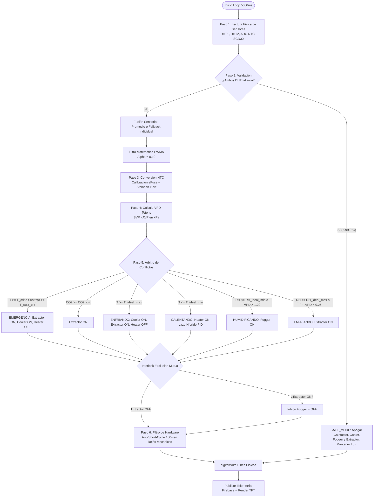

# Informe Técnico N° 23: Algoritmo de Control de Microclima Industrial (AgriEdge OS)

**Sistema Operativo:** AgriEdge OS — Edge Firmware (ESP32)  
**Autor:** Ingeniero de Control y Automatización Senior (AgroTech IoT)  
**Fecha:** 15 de Agosto de 2026  
**Revisión:** 3.2.0 (Post-Auditoría de Control Industrial)  
**Estado:** ✅ PRODUCCIÓN / VERIFICADO EN HARDWARE REAL  

---

## 1. 📋 Resumen del Sistema

El firmware del **ESP32** en AgriEdge OS opera como un **Controlador Lógico Programable (PLC) Determinista de 3 Capas**. Su propósito fundamental es gobernar de forma autónoma el microclima dentro de cámaras de cultivo cerradas (Hongos y Vegetales de Alto Rendimiento), regulando con precisión milimétrica la temperatura, la humedad relativa ($\text{RH}$), el Déficit de Presión de Vapor ($\text{VPD}$), los niveles de $\text{CO}_2$ y el ciclo de iluminación circadiano.

El sistema está diseñado para operar con **independencia total de la red (100% Edge Autonomy)**, ejecutando lazos de control locales cerrados y sincronizando telemetría y perfiles con **Firebase Realtime Database (RTDB)** de forma asíncrona y no bloqueante.

```
┌─────────────────────────────────────────────────────────────────────────┐
│                           CAPAS DE CONTROL                              │
├─────────────────────────────────────────────────────────────────────────┤
│  Capa 1: Modelado Agronómico (Perfiles Biológicos en LittleFS / RAM)   │
│  Capa 2: Árbitro de Decisiones Determinista + Lazo PID Híbrido          │
│  Capa 3: Capa de Abstracción de Hardware + Filtros Físicos (Anti-Chatter)│
└─────────────────────────────────────────────────────────────────────────┘
```

### Tabla Resumen de Hardware: Sensores y Actuadores

| Componente | Tipo Hardware | Pin GPIO | Variable / Función | Rango / Lógica | Unidad |
| :--- | :--- | :--- | :--- | :--- | :--- |
| **DHT22 (Sensor 1)** | Digital One-Wire | `GPIO 27` | Temp. / Humedad Ambiente 1 | $-40\text{ a }80^\circ\text{C}$ / $0\text{ a }100\%$ | $^\circ\text{C}$ / $\%$ |
| **DHT22 (Sensor 2)** | Digital One-Wire | `GPIO 26` | Temp. / Humedad Ambiente 2 (Redundancia) | $-40\text{ a }80^\circ\text{C}$ / $0\text{ a }100\%$ | $^\circ\text{C}$ / $\%$ |
| **Termistor NTC 10k** | Analógico (ADC1_CH6) | `GPIO 34` | Temperatura de Sustrato / Raíz | $-10\text{ a }80^\circ\text{C}$ | $^\circ\text{C}$ |
| **SCD30 (Opcional)** | I2C Bus (`0x61`) | `SDA:21, SCL:22` | Concentración de $\text{CO}_2$ NDIR | $400\text{ a }10000$ | $\text{ppm}$ |
| **Calefactor (CAL)** | Relé SSR (Estado Sólido) | `GPIO 4` | Elevación Térmica / Resistencia | Activo HIGH (PWM por Software) | Estado / ms |
| **Enfriador (COOL)** | Relé Electromecánico | `GPIO 17` | Celda Peltier / Climatizador | Activo HIGH | Booleano |
| **Humidificador (NBL)**| Relé Electromecánico | `GPIO 25` | Generador de Niebla Ultrasónica | Activo HIGH | Booleano |
| **Extractor (EXT)** | Relé Electromecánico | `GPIO 32` | Evacuación de Calor / $\text{CO}_2$ / $\text{RH}$ | Activo HIGH | Booleano |
| **Iluminación (LUZ)** | Relé Electromecánico | `GPIO 16` | Lámparas LED / Fotoperiodo | Activo **LOW** (Inverso) | Booleano |
| **Display TFT ST7735**| SPI Bus | `CS:5, DC:14, RST:13` | HMI Visual Local Anti-Flicker | $160\times 128\text{ px}$ | Gráfico |

---

## 2. 📖 Flujo del Algoritmo (Paso a Paso)

El ciclo de ejecución está desacoplado en dos frecuencias de tiempo dentro de [`main.cpp`](file:///c:/Users/lagos/PROYECTOS/ESP32Proyecto%20-%20Industrial/monitor-iot-backend/proyecto-iot-code-workspace/edge_esp32/src/main.cpp):
1. **Lazo de Alta Frecuencia (Every Loop Iteration, $\approx 1-5\,\text{ms}$):** Ejecuta `hw.actualizarModulacionSSR(millis())` para conmutar el relé de estado sólido (SSR) del calefactor con resolución de milisegundos mediante modulación de ancho de pulso por tiempo (*Time-Proportioning*).
2. **Lazo Termodinámico Principal (`INTERVALO_CICLO = 5000 ms`):** Lee sensores físicos, filtra señales, calcula VPD, evalúa la máquina de estados y despacha los comandos a los relés.



---

### Paso 1 — Lectura Física de Sensores
* **Mecanismo:** No bloqueante vía temporizador `millis()` cada $5000\,\text{ms}$ ([`main.cpp:L205`](file:///c:/Users/lagos/PROYECTOS/ESP32Proyecto%20-%20Industrial/monitor-iot-backend/proyecto-iot-code-workspace/edge_esp32/src/main.cpp#L205)).
* **Lecturas:** Se consultan los objetos `DHTesp` para DHT1 y DHT2, se leen 32 muestras del ADC en GPIO 34, y se consulta el bus I2C en `0x61` si el sensor SCD30 está conectado.

---

### Paso 2 — Validación, Fusión Sensorial y Filtro EWMA
* **Validación de Fallos:** Si una lectura de DHT es `isnan()`, se desactiva su bandera de salud (`dhtOk = false` o `dht2Ok = false`).
* **Fusión Redundante:**
  $$\text{tempPromedio} = \begin{cases} 
  \frac{T_{\text{DHT1}} + T_{\text{DHT2}}}{2}, & \text{si ambos están OK} \\
  T_{\text{DHT1}}, & \text{si solo DHT1 está OK} \\
  T_{\text{DHT2}}, & \text{si solo DHT2 está OK} \\
  -999.0^\circ\text{C}, & \text{si ambos fallaron (Dispara SAFE\_MODE)}
  \end{cases}$$
* **Filtro EWMA ($\alpha = 0.10$):** Protege el lazo de control contra turbulencias de aire o apertura de compuertas:
  $$Y(n) = \alpha \cdot X(n) + (1 - \alpha) \cdot Y(n-1)$$
  Si el sistema detecta desconexión total ($-999.0^\circ\text{C}$), el filtro EWMA se reinicia inmediatamente a $-999.0^\circ\text{C}$ sin arrastrar inercia falsa.

---

### Paso 3 — Conversión Matemática del Termistor NTC
La conversión de la sonda analógica de sustrato en [`HardwareController.cpp:L138-158`](file:///c:/Users/lagos/PROYECTOS/ESP32Proyecto%20-%20Industrial/monitor-iot-backend/proyecto-iot-code-workspace/edge_esp32/src/HardwareController.cpp#L138-L158) no usa lecturas crudas directas, sino **Calibración eFuse Two-Point + Multisampling**:
1. **Multisampling:** 32 lecturas consecutivas separadas por $30\,\mu\text{s}$ para mitigar ruido térmico del ADC:
   $$\text{adcRawAvg} = \frac{1}{32} \sum_{i=1}^{32} \text{ADC}_{\text{raw}}[i]$$
2. **Linealización eFuse de ESP32:** Se convierte a milivoltios reales con la curva calibrada de fábrica:
   $$\text{voltageMv} = \text{esp\_adc\_cal\_raw\_to\_voltage}(\text{adcRawAvg}, \&\_adcChars)$$
3. **Cálculo de Resistencia del Termistor (Divisor de Tensión con Resistencia en Serie a VCC):**
   $$R_{\text{NTC}} = \frac{R_{\text{SERIE}}}{\left(\frac{V_{\text{REF\_MV}}}{\text{voltageMv}}\right) - 1.0}$$
   *Constantes:* $R_{\text{SERIE}} = 10000\,\Omega$, $V_{\text{REF\_MV}} = 3300\,\text{mV}$.
4. **Ecuación de Parámetro $\beta$ (Aproximación de Steinhart-Hart):**
   $$\frac{1}{T_{\text{Kelvin}}} = \frac{1}{T_{\text{NOMINAL}} + 273.15} + \frac{1}{\beta} \ln\left(\frac{R_{\text{NTC}}}{R_{\text{NOMINAL}}}\right)$$
   $$T_{\text{sustrato}} (^\circ\text{C}) = T_{\text{Kelvin}} - 273.15$$
   *Constantes:* $R_{\text{NOMINAL}} = 10000\,\Omega$, $T_{\text{NOMINAL}} = 25.0^\circ\text{C}$, $\beta = 3950\,\text{K}$.

---

### Paso 4 — Cálculo del Déficit de Presión de Vapor (VPD)
Se implementa la fórmula psicrométrica de **Tetens** ([`HardwareController.cpp:L272-276`](file:///c:/Users/lagos/PROYECTOS/ESP32Proyecto%20-%20Industrial/monitor-iot-backend/proyecto-iot-code-workspace/edge_esp32/src/HardwareController.cpp#L272-L276)):
1. **Presión de Vapor de Saturación (SVP en $\text{kPa}$):**
   $$\text{SVP}(T) = 0.61078 \cdot \exp\left(\frac{17.27 \cdot T}{T + 237.3}\right)$$
2. **Presión de Vapor Actual (AVP en $\text{kPa}$):**
   $$\text{AVP}(T, \text{RH}) = \text{SVP}(T) \cdot \left(\frac{\text{RH}}{100.0}\right)$$
3. **Déficit de Presión de Vapor:**
   $$\text{VPD} = \text{SVP} - \text{AVP}$$

---

### Paso 5 — Evaluación de Reglas y Árbitro de Conflictos

La lógica evalúa las condiciones en estricto orden jerárquico determinista:

#### A. Jerarquía 1 (Supervivencia Catastrófica):
* Si $T_{\text{amb}} \ge 35.0^\circ\text{C}$ $\lor$ $T_{\text{amb}} \ge T_{\text{crit\_max}}$ $\lor$ $T_{\text{sustrato}} \ge T_{\text{sustrato\_crit\_max}}$:
  * **Estado:** `EMERGENCIA`
  * **Comandos:** `EXTRACTOR = ON`, `COOLER = ON`, `HEATER = OFF` (bloqueo forzado).

#### B. Jerarquía 2 (Toxicidad por $\text{CO}_2$):
* Si $\text{CO}_2 \ge \text{co2\_crit\_max}$:
  * **Comando:** `EXTRACTOR = ON` (purga de aire viciado).

#### C. Jerarquía 3 (Demanda de Frío con Histéresis):
* Si $T_{\text{amb}} \ge T_{\text{ideal\_max}}$ (o $T_{\text{amb}} \ge T_{\text{ideal\_max}} - 0.5^\circ\text{C}$ si ya estaba enfriando):
  * **Estado:** `ENFRIANDO`
  * **Comandos:** `COOLER = ON`, `EXTRACTOR = ON`, `HEATER = OFF`.

#### D. Jerarquía 4 (Demanda de Calor — Control Híbrido PID):
* Si $T_{\text{amb}} \le T_{\text{ideal\_min}}$ (o $T_{\text{amb}} \le T_{\text{ideal\_min}} + 0.5^\circ\text{C}$ si ya estaba calentando):
  * **Estado:** `CALENTANDO`
  * **Modulación:**
    * Si $T_{\text{amb}} \le T_{\text{ideal\_min}} - 0.5^\circ\text{C}$: **100% de potencia continua** ($5000\,\text{ms} / 5000\,\text{ms}$).
    * Si $T_{\text{amb}} \in [T_{\text{ideal\_min}} - 0.5^\circ\text{C}, T_{\text{ideal\_min}}]$: Modulación PID ($K_p=1500, K_i=100, K_d=250$) calculando el duty cycle en ventana de $5000\,\text{ms}$.

#### E. Jerarquía 5 (Microclima Hídrico y Transpiración VPD):
* **Demanda de Humidificación:** Si $\text{RH} \le \text{hum\_ideal\_min}$ $\lor$ $\text{VPD} > 1.20\,\text{kPa}$:
  * **Comando:** `FOGGER = ON` (Estado: `HUMIDIFICANDO`).
* **Demanda de Deshumidificación:** Si $\text{RH} \ge \text{hum\_ideal\_max}$ $\lor$ $\text{VPD} < 0.25\,\text{kPa}$:
  * **Comando:** `EXTRACTOR = ON` (Estado: `ENFRIANDO`).

#### F. Interlock de Exclusión Mutua:
* $$\text{Si } \text{EXTRACTOR} == \text{ON} \implies \text{FOGGER} = \text{OFF}$$
  *Inhibe la niebla durante la extracción para no expulsar humedad condensada por los ductos.*

#### G. Fotoperiodo:
* Si $\text{horaDia} \in [0, \text{light\_hours\_on})$ $\implies$ `LIGHT = ON` (Lógica invertida en hardware: `digitalWrite(PIN_LIGHT, LOW)`).

---

### Paso 6 — Ejecución Física y Filtro Anti-Short-Cycle
Antes de conmutar los pines, el método `_ejecutarAccion` ([`HardwareController.cpp:L278-304`](file:///c:/Users/lagos/PROYECTOS/ESP32Proyecto%20-%20Industrial/monitor-iot-backend/proyecto-iot-code-workspace/edge_esp32/src/HardwareController.cpp#L278-L304)) aplica un filtro industrial asimétrico:
* **APAGAR (`OFF`):** Retardo $= 0\,\text{ms}$ (Corte inmediato por seguridad).
* **RE-ENCENDER (`ON`):** Requiere que hayan transcurrido al menos **$180\,\text{segundos}$** (`MIN_RELAY_TIME_MS = 180000`) desde el último apagado en relés electromecánicos (`EXTRACTOR`, `FOGGER`, `COOLER`).
* **Exenciones:** El relé `LIGHT` y el relé SSR de `HEATER` están exentos de este retardo para permitir fotoperiodo exacto y modulación rápida PID.

---

## 3. ⚙️ Parámetros de Configuración

| Parámetro | Valor por Defecto | Fuente | Configurable por Usuario | Descripción Técnica |
| :--- | :--- | :--- | :---: | :--- |
| `greenhouse_id` | `"CHAMBER_01"` | `config.json` | ✅ Sí | Identificador único del dispositivo / cámara. |
| `crop_profile` | `"Fungi_Fruiting_v1"` | `config.json` | ✅ Sí | Nombre del perfil biológico activo. |
| `temp_ideal_min` | $18.0^\circ\text{C}$ (Fungi) / $25.0^\circ\text{C}$ | `config.json` | ✅ Sí | Umbral mínimo para disparo del calefactor PID. |
| `temp_ideal_max` | $24.0^\circ\text{C}$ (Fungi) / $27.0^\circ\text{C}$ | `config.json` | ✅ Sí | Umbral máximo para disparo de Cooler y Extractor. |
| `temp_crit_min` | $10.0^\circ\text{C}$ | `config.json` | ✅ Sí | Límite crítico inferior de estrés térmico. |
| `temp_crit_max` | $28.0^\circ\text{C}$ | `config.json` | ✅ Sí | Límite crítico superior que dispara Failsafe. |
| `temp_sustrato_ideal` | $24.0^\circ\text{C}$ | `config.json` | ✅ Sí | Temperatura objetivo en la zona radicular. |
| `temp_sustrato_crit_max` | $27.0^\circ\text{C}$ | `config.json` | ✅ Sí | Límite crítico de fermentación en sustrato. |
| `hum_ideal_min` | $85.0\%$ | `config.json` | ✅ Sí | Umbral inferior de humedad para encender Fogger. |
| `hum_ideal_max` | $95.0\%$ | `config.json` | ✅ Sí | Umbral superior de humedad para encender Extractor. |
| `hum_crit_min` | $70.0\%$ | `config.json` | ✅ Sí | Límite crítico de desecación celular. |
| `co2_ideal_min` | $400\,\text{ppm}$ | `config.json` | ✅ Sí | Nivel base atmosférico de referencia. |
| `co2_ideal_max` | $800\,\text{ppm}$ | `config.json` | ✅ Sí | Nivel superior deseable antes de renovación. |
| `co2_crit_max` | $1000\,\text{ppm}$ | `config.json` | ✅ Sí | Umbral de toxicidad que fuerza extracción. |
| `light_hours_on` | $12\,\text{horas}$ | `config.json` | ✅ Sí | Horas de luz activas por día (0:00 a N:00). |
| `max_manual_time_ms` | $900000\,\text{ms}$ ($15\text{ min}$) | `config.json` | ✅ Sí | Tiempo máximo antes de auto-revertir MANUAL a AUTO. |
| `watchdog_timeout_ms`| $10000\,\text{ms}$ ($10\text{ s}$) | `config.json` | ✅ Sí | Tiempo límite para el Hardware Watchdog. |
| `max_internal_temp_limit_c` | $35.0^\circ\text{C}$ | `config.json` | ✅ Sí | Límite de seguridad de cabina electrónica. |
| `ALPHA_EWMA` | `0.10` | Hardcoded | ❌ No (`HardwareController.h`) | Factor de suavizado exponencial paso-bajos. |
| `HIST_TEMP` | `0.5 °C` | Hardcoded | ❌ No (`HardwareController.h`) | Banda muerta de histéresis térmica. |
| `HIST_HUM` | `2.0 %` | Hardcoded | ❌ No (`HardwareController.h`) | Banda muerta de histéresis hídrica. |
| `MIN_RELAY_TIME_MS` | `180000 ms` | Hardcoded | ❌ No (`HardwareController.h`) | Tiempo Anti-Short-Cycle (3 minutos). |
| `PID_WINDOW_SIZE` | `5000 ms` | Hardcoded | ❌ No (`HardwareController.h`) | Ventana de tiempo PWM del SSR. |
| `Kp, Ki, Kd (PID)` | `1500, 100, 250` | Hardcoded | ❌ No (`HardwareController.cpp`) | Ganancias del controlador PID de temperatura. |

---

## 4. 🛡️ Mecanismos de Protección y Seguridad

| Mecanismo de Protección | Estado | Evidencia en Código | Justificación / Funcionamiento |
| :--- | :---: | :--- | :--- |
| **Histéresis (Banda Muerta)** | ✅ Implementado | [`HardwareController.h:44-45`](file:///c:/Users/lagos/PROYECTOS/ESP32Proyecto%20-%20Industrial/monitor-iot-backend/proyecto-iot-code-workspace/edge_esp32/src/HardwareController.h#L44-L45)<br>[`HardwareController.cpp:389-424`](file:///c:/Users/lagos/PROYECTOS/ESP32Proyecto%20-%20Industrial/monitor-iot-backend/proyecto-iot-code-workspace/edge_esp32/src/HardwareController.cpp#L389-L424) | `HIST_TEMP = 0.5°C` y `HIST_HUM = 2.0%` impiden conmutaciones continuas en la frontera del umbral. |
| **Anti-Short-Cycle (Anti-Chatter)**| ✅ Implementado | [`HardwareController.cpp:278-294`](file:///c:/Users/lagos/PROYECTOS/ESP32Proyecto%20-%20Industrial/monitor-iot-backend/proyecto-iot-code-workspace/edge_esp32/src/HardwareController.cpp#L278-L294) | Bloqueo de 180s antes de re-encender Cooler, Extractor o Fogger. Protege compresores y fuentes de poder. |
| **Failsafe Térmico de Emergencia** | ✅ Implementado | [`HardwareController.cpp:374-381`](file:///c:/Users/lagos/PROYECTOS/ESP32Proyecto%20-%20Industrial/monitor-iot-backend/proyecto-iot-code-workspace/edge_esp32/src/HardwareController.cpp#L374-L381) | Prioridad P1: Apaga forzosamente el calefactor y activa refrigeración si $T \ge 35^\circ\text{C}$ o sustrato $\ge 27^\circ\text{C}$. |
| **Fallback ante Sensor Dañado** | ✅ Implementado | [`HardwareController.cpp:161-174`](file:///c:/Users/lagos/PROYECTOS/ESP32Proyecto%20-%20Industrial/monitor-iot-backend/proyecto-iot-code-workspace/edge_esp32/src/HardwareController.cpp#L161-L174) | Redundancia dual DHT22. Si ambos fallan, conmuta a `SAFE_MODE` apagando todos los actuadores de potencia. |
| **Prioridad y Exclusión de Actuadores**| ✅ Implementado | [`HardwareController.cpp:434-439`](file:///c:/Users/lagos/PROYECTOS/ESP32Proyecto%20-%20Industrial/monitor-iot-backend/proyecto-iot-code-workspace/edge_esp32/src/HardwareController.cpp#L434-L439) | Interlock determinista: El Extractor inhibe forzosamente el Fogger para no expulsar la niebla. |
| **Hardware Watchdog (WDT)** | ✅ Implementado | [`main.cpp:124-128, 149`](file:///c:/Users/lagos/PROYECTOS/ESP32Proyecto%20-%20Industrial/monitor-iot-backend/proyecto-iot-code-workspace/edge_esp32/src/main.cpp#L124-L128) | `esp_task_wdt` reinicia el ESP32 en 15s si ocurre un bloqueo de CPU o fallo en handshake TLS. |
| **Modo Supervivencia (Offline Edge)**| ✅ Implementado | [`FileManager.cpp:19-60`](file:///c:/Users/lagos/PROYECTOS/ESP32Proyecto%20-%20Industrial/monitor-iot-backend/proyecto-iot-code-workspace/edge_esp32/src/FileManager.cpp#L19-L60) | El microcontrolador arranca y regula el cultivo usando LittleFS aun si no hay conexión WiFi o Firebase. |

---

## 5. 🔄 Interacción con Firebase (Control Remoto)

1. **Protocolo Downlink (Stream SSE):**
   * El ESP32 se suscribe reactivamente a `/devices/{deviceId}/commands` usando Server-Sent Events en [`FirebaseManager.cpp:L255-278`](file:///c:/Users/lagos/PROYECTOS/ESP32Proyecto%20-%20Industrial/monitor-iot-backend/proyecto-iot-code-workspace/edge_esp32/src/FirebaseManager.cpp#L255-L278).
   * Cuando el usuario cambia un setpoint o presiona un botón en el SCADA React, Firebase empuja el payload de inmediato sin polling.
2. **Separación Determinista AUTO vs MANUAL:**
   * **Modo AUTO:** La máquina de estados del ESP32 gobierna los relés según las reglas agronómicas y el PID. Si llega un comando manual directo (`setHeater`, etc.) mientras está en `AUTO`, el firmware lo **descarta** para proteger la cosecha ([`HardwareController.cpp:L72`](file:///c:/Users/lagos/PROYECTOS/ESP32Proyecto%20-%20Industrial/monitor-iot-backend/proyecto-iot-code-workspace/edge_esp32/src/HardwareController.cpp#L72)).
   * **Transición Atómica:** Al enviar un comando manual desde el SCADA, el servicio despacha atómicamente `{ modo_operacion: 'MANUAL', [actuator]: state }`.
   * **Auto-Reversión de Seguridad (Watchdog de Operador):** El modo manual inicia un cronómetro interno (`_tiempoInicioManual`). Al transcurrir `max_manual_time_ms` (por defecto 15 min), el ESP32 revierte automáticamente a `AUTO` para evitar que un olvido humano destruya el cultivo.
3. **Telemetría Uplink en Tiempo Real:**
   * Cada $5000\,\text{ms}$, el ESP32 empaqueta todas las lecturas filtradas por EWMA, el estado real de los relés físicos, las banderas de bloqueo por anti-short-cycle y el estado operacional en `/telemetry/{deviceId}/data`.
   * Cada $5\text{ minutos}$, empuja un registro histórico inmutable con timestamp NTP a `/history/{deviceId}`.

---

## 6. 📊 Análisis Crítico y Brechas

### Clasificación de Sofisticación del Algoritmo
$$\mathbf{[X] \text{ Control PID y Determinista con Protecciones Industriales (Nivel Profesional / Industrial)}}$$

*Justificación:* El algoritmo supera con creces un control ON/OFF básico. Cuenta con desacoplamiento en 3 capas, fusión redundante de sensores con fallback, filtro matemático digital EWMA, modelado psicrométrico de VPD (Tetens), lazo PID con modulación Time-Proportioning de alta frecuencia para relés SSR, histéresis paramétrica, temporizadores de protección física de potencia (Anti-Short-Cycle) y árbitro de exclusión mutua.

---

### Top 5 Mejoras de Próxima Generación

1. **Crop Steering Dinámico en Firmware (Rampas Diarias Graduales):**
   * *Objetivo:* Permitir transiciones suaves de temperatura y VPD (ej. decrementar $0.5^\circ\text{C}/\text{día}$) calculadas directamente por el ESP32 a partir de la fecha de inicio del ciclo.
2. **Calibración y Control Proporcional del Extractor mediante Triac/PWM (Dimmer AC):**
   * *Objetivo:* Reemplazar la conmutación binaria ON/OFF del extractor por modulación de velocidad del flujo de aire ($0-100\%$) para renovaciones de $\text{CO}_2$ sin desplomar la temperatura.
3. **Estimación de Inercia Térmica por Matriz de Derivada (Feed-Forward):**
   * *Objetivo:* Anticipar la subida de temperatura al encender la iluminación artificial y reducir el calentamiento antes de que ocurra el sobrepico.
4. **Control Independiente de Manta Térmica de Sustrato (6to Canal de Potencia):**
   * *Objetivo:* Asignar un canal de potencia dedicado para elevar la temperatura del sustrato cuando esté frío, manteniendo el NTC no solo como sensor de emergencia sino como variable de control activo.
5. **Autotuning de Parámetros PID (Algoritmo Ziegler-Nichols en Edge):**
   * *Objetivo:* Función de calibración automática en el primer arranque que mida la inercia térmica de la cámara para autoajustar $K_p, K_i, K_d$ óptimos.

---

## 7. 📝 Conclusión

El algoritmo de microclima de **AgriEdge OS** se encuentra en un estado **altamente robusto, determinista y seguro para producción industrial**. Sus mayores virtudes son la resiliencia frente a fallos de red/sensores (operación local LittleFS, redundancia dual DHT, safe-mode y WDT) y la precisión en la modulación térmica mediante PID híbrido y anti-short-cycle.

**Recomendación Inmediata para el Próximo Sprint:**
Implementar la **sincronización nativa del motor de Crop Steering Dinámico** para que las curvas fenológicas de transición calculadas en el SCADA React sean ejecutadas de forma autónoma por el microcontrolador mediante interpolación temporal en LittleFS.
