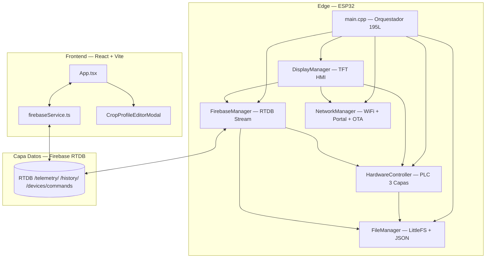

# Auditoría Técnica y Estratégica — AgriEdge OS / Cámara Fungi Inteligente
**Fecha:** 6 de agosto de 2026
**Auditor:** Arquitecto Senior IoT (Rol externo e imparcial)
**Fuente de verdad:** Código fuente directo en `edge_esp32/src/` (12 archivos) + 61 documentos de sprint

---

## 1. 📊 ESTADO EJECUTIVO DEL PROYECTO

### Semáforo de Salud General: 🟡 En Riesgo

**Justificación con datos del código:**
El firmware ESP32 acaba de completar una migración arquitectónica mayor (Motor de Reglas → CropProfile PLC de 3 Capas). El código en disco refleja la nueva arquitectura correctamente implementada. Sin embargo, el control bidireccional vía Firebase (modo MANUAL + relés) **nunca funcionó de forma confiable en hardware real** según el historial de sesiones. El modo manual que se revertía instantáneamente fue una regresión introducida el 5 de agosto. El día cerró sin commit, sin resolución y con ruptura de confianza.

### Sprint Actual Estimado

**Sprint 12-13** (según los 61 documentos archivados). Completitud del MVP: **~70%**.

Los módulos funcionales: telemetría unidireccional (ESP32 → Firebase → React), Portal Cautivo, OTA, TFT display, arquitectura OOP, motor PLC determinista.
Los módulos **no validados en hardware real**: control bidireccional confiable (modo MANUAL + relés), fotoperiodo por NTP end-to-end, nuevo CropProfile integrado end-to-end.

### Logros Verificados Directamente en el Código

1. **Arquitectura OOP completa** — `main.cpp` de 195 líneas, 5 módulos con responsabilidades únicas.
2. **Motor PLC de 3 Capas** — `HardwareController.cpp` con árbitro de conflictos jerarquizado, filtro anti-short-cycle de 180s.
3. **Portal Cautivo + reconexión autónoma** — `NetworkManager.cpp` (438 líneas) con fallback AP tras 60s offline.
4. **CropProfile agnóstico con retrocompatibilidad** — `FileManager` detecta JSON antiguo con `reglas` y migra automáticamente al default seguro.
5. **Filtro anti-short-cycle hardcoded** — `MIN_RELAY_TIME_MS = 180000` en `HardwareController.h` (protección física real de hardware).

### Resumen en 5 Líneas

El proyecto tiene la mejor base arquitectónica de su historia. La migración al CropProfile PLC acaba de completarse en código pero no ha sido validada en hardware. El problema crítico y persistente es el control bidireccional (relés vía Firebase en modo MANUAL), que nunca funcionó confiablemente. El frontend React inició la migración a `DeviceCropProfile` pero los tipos TypeScript están inconsistentes con el firmware. No hay commits regulares, lo que convierte cada sesión de trabajo en una operación de alto riesgo con todo el progreso expuesto a pérdida total.

---

## 2. 🏗️ AUDITORÍA DE ARQUITECTURA

### Diagrama de Componentes



### Evaluación de Modularidad (SRP)

| Módulo | Responsabilidad | SRP | Observación |
|---|---|---|---|
| `main.cpp` | Orquestación + timers | ✅ | Solo instancia y llama `.loop()`. Minimalista. |
| `HardwareController` | Sensores + Actuadores + PLC | ⚠️ | Tiene lectura de sensores, lógica PLC Y máquina de estados. Aceptable en ESP32. |
| `FileManager` | Persistencia JSON/LittleFS | ✅ | Bien separado, responsabilidad única. |
| `FirebaseManager` | Cloud I/O + stream parser | ⚠️ | `_procesarPayloadStream` mezcla parsing de red con lógica de negocio. |
| `NetworkManager` | WiFi + Portal + OTA + NTP + API REST local | ⚠️ | HTML embebido en PROGMEM y API REST local violan SRP teóricamente. |
| `DisplayManager` | Render TFT | ✅ | Solo lectura, `const&` en todas las dependencias. Impecable. |

### Evaluación del Motor Agnóstico (CropProfile)

**Estado verificado en código:** `FileManager.cpp` guarda/carga el objeto `crop` con todos los setpoints. `HardwareController.cpp:166` los consume directamente. Correctamente desacoplado.

**¿Funciona para múltiples perfiles?** Sí. `cargarConfiguracion()` detecta JSON con `reglas` (formato antiguo) y fuerza migración. El perfil FUNGI por defecto (`temp_ideal_min=18`, `hum_ideal_min=85`) está en `_crearConfiguracionPorDefecto()`.

### Evaluación del Modo AUTO/MANUAL

**Implementado en firmware:** El timer de caducidad existe con protección de underflow (parche 5/8). El problema no es la implementación sino la **integración con Firebase Stream**.

**Bug raíz documentado (no resuelto):** La librería `FirebaseESP32 v4.4.17` devuelve `jsonString()` vacío para payloads de tipo `boolean`. El parche `boolData()` existe en `streamCallback()` pero el test en hardware del 5/8 falló, indicando un segundo punto de falla no identificado aún.

### Evaluación del Failsafe / Edge Computing

**Sin WiFi:** El sistema puede operar autónomamente. Evidencia:
- `hw.procesarLogicaDeControl()` se ejecuta en `loop()` independientemente de `net.estaConectado()`.
- Portal cautivo se activa si WiFi falla (línea 237 de `NetworkManager.cpp`).
- Configuración persiste en LittleFS sin necesidad de red.

**Riesgo detectado:** Sin NTP, `net.getHoraInt()` devuelve `-1`. En `HardwareController.cpp:194`: `if (horaDia >= 0 && horaDia < _config.crop.light_hours_on)`. **La luz se apaga permanentemente si pierde red.** Correcto por seguridad, pero debe documentarse para el cliente.

---

## 3. 💾 AUDITORÍA DE MEMORIA Y RENDIMIENTO

### Flash — Respuesta definitiva sobre OTA

El reporte de compilación del 5/8 mostró **~91-92% de uso de flash**. El ESP32 usa particiones duales OTA (`OTA_0 + OTA_1`). Cada partición debe alojar el firmware completo.

> [!CAUTION]
> Con ~92% de flash usado, el firmware está en el límite del tamaño de cada partición OTA (~1.4MB con la tabla por defecto). Si el código crece, la **próxima OTA fallará silenciosamente**. Verificar inmediatamente si `platformio.ini` tiene `board_build.partitions` personalizado.

### RAM — Riesgos Identificados

El sistema usa simultáneamente:
- `DynamicJsonDocument(2048)` × 2 instancias posibles (FileManager + FirebaseManager)
- Stack SSL de Firebase (~20KB heap)
- Stack AsyncWebServer
- Stack TFT Adafruit ST7735
- FreeRTOS task con `8192` bytes de stack (NetworkManager)

**Riesgo:** `DynamicJsonDocument(2048)` alloca en heap. Bajo condiciones de reconexión, puede fragmentar el heap y causar crash en operación prolongada (días).

### Problema OTA — Diagnóstico Causa Raíz

El OTA llega al 100% pero falla al confirmar. Causas en orden de probabilidad:

1. **Watchdog Timer (WDT):** El loop principal sigue ejecutando Firebase durante el flash. Un SSL handshake largo (>15s) reinicia el ESP32 antes de confirmar. *Solución: `ArduinoOTA.onStart` para desconectar Firebase.*
2. **Partición llena:** El firmware supera el tamaño de la partición OTA destino. *Solución: tabla de particiones personalizada.*
3. **Paquete ACK perdido:** El 300s de timeout resolvió la espera de la PC, pero el ESP32 puede perder el ACK final de confirmación por WiFi.

### Recomendaciones de Optimización

- Reemplazar `DynamicJsonDocument(2048)` por `StaticJsonDocument<2048>` (elimina fragmentación de heap).
- Agregar `ArduinoOTA.onStart([](){ Firebase.end(); })` para proteger el OTA.

---

## 4. 🧪 AUDITORÍA DE SENSORES Y ACTUADORES

### DHT22 — ✅ Robusto

Evidencia en `HardwareController.cpp:74`:
```cpp
if (isnan(t) || isnan(h)) {
    _sensores.dhtOk = false;
```
Manejo correcto de fallos. El flag `dhtOk` se propaga a telemetría y TFT.

### NTC / Termistor — ⚠️ Funcional con Error Conocido

Fórmula en `HardwareController.cpp:87-89` es la **ecuación beta de Steinhart-Hart simplificada**. Matemáticamente correcta.

**Problema:** El ADC del ESP32 (GPIO 34) tiene no-linealidad de ~±5% sin calibración (`esp_adc_cal_characterize()`). Error de hasta 2°C en el rango 18-28°C. Aceptable para MVP, inaceptable para producto comercial.

**Riesgo adicional:** `if (valorADC > 0 && valorADC < 4095)` no protege contra ruido. Un valor de 100 ADC calcularía ~150°C. Se recomienda filtro post-cálculo con rango lógico (ej: descartar si `tempK` está fuera de -10 a 80°C).

### Relés — Histéresis PARCIALMENTE Implementada

> [!IMPORTANT]
> El **anti-short-cycle de 180s** (tiempo mínimo entre cambios) NO es lo mismo que **histéresis de temperatura** (banda muerta entre umbral ON y OFF). Actualmente, si la temperatura oscila alrededor del umbral exacto, el estado lógico `req_heater` puede alternarse cada 5 segundos, aunque físicamente el relé está protegido por los 3 minutos. La **histéresis real no está implementada**, lo cual es deuda técnica para uso comercial.

### Etiquetas TFT — ✅ En Español

Confirmado en `DisplayManager.cpp:125-145`: `CAL`, `NBL`, `EXT`, `LUZ`. Correcto.

**Bug menor:** NTC muestra unidad `U` (línea 107). Debería mostrar `°C`.

---

## 5. ☁️ AUDITORÍA DE CONECTIVIDAD Y NUBE

### Portal Cautivo — ✅ Implementado y Funcional

`NetworkManager.cpp` genera SSID único, DNS sinker, formulario HTML. Un cliente final puede configurar WiFi sin código.

**Riesgo:** Race condition potencial entre el loop de Firebase (Core 1) y el cambio de modo STA→AP. El flag `volatile bool _conexionEstable` mitiga pero no elimina el riesgo completamente.

### Seguridad de Credenciales Firebase

> [!CAUTION]
> `Secrets.h` contiene API Key, URL RTDB, email y contraseña de administrador **en texto plano**. No se pudo verificar si está en `.gitignore`. Si fue commiteado en `luckybjj-dev/iot-industrial`, las credenciales están expuestas permanentemente en el historial Git. Verificar: `git log --all -- src/Secrets.h`

### Password OTA — 🔴 No Configurado

```cpp
// main.cpp:150-153
ArduinoOTA.setHostname(deviceId.c_str());
ArduinoOTA.begin();  // ← Sin setPassword()
```
Cualquier persona en la red local puede flashear el dispositivo.

### Reconexión WiFi — ✅ Manejada

`WiFi.setAutoReconnect(true)` + bucle FreeRTOS de monitoreo. Firebase usa lazy-init al reconectar. Correcto.

---

## 6. 🔴 DEUDA TÉCNICA Y RIESGOS CRÍTICOS

| # | Problema Identificado | Archivo / Función | Severidad | Impacto si no se corrige |
|---|---|---|---|---|
| 1 | `Secrets.h` sin confirmar en `.gitignore`. Credenciales Firebase expuestas. | `Secrets.h` | 🔴 Alta | Compromiso total de la RTDB. |
| 2 | Sin password OTA. Flasheable por cualquiera en la red. | `main.cpp:150` | 🔴 Alta | Firmware malicioso en instalaciones de clientes. |
| 3 | Control bidireccional MANUAL+relés nunca validado en hardware. | `FirebaseManager.cpp::streamCallback` | 🔴 Alta | La feature core del producto no funciona. |
| 4 | Sin histéresis real de temperatura. Solo anti-short-cycle. | `HardwareController.cpp:176-182` | 🟡 Media | Estado lógico oscilante en umbrales exactos. |
| 5 | ADC NTC sin calibración. Error ~2°C. | `HardwareController.cpp:87-89` | 🟡 Media | Temperatura de sustrato incorrecta en producto comercial. |
| 6 | `DynamicJsonDocument` en heap. Fragmentación posible. | `FileManager.cpp:31`, `FirebaseManager.cpp:195` | 🟡 Media | Crash en operación prolongada (días). |
| 7 | Flash al ~92%. Particiones OTA sin verificar. | `platformio.ini` | 🟡 Media | OTA falla si firmware crece. |
| 8 | NTC muestra unidad `U` en TFT en lugar de `°C`. | `DisplayManager.cpp:107` | 🟢 Baja | Confusión visual para el usuario. |
| 9 | WiFi SSID/Password hardcodeado. | `main.cpp:41-42` | 🟡 Media | Requiere recompilación por cliente. |
| 10 | Sin commit al cerrar sprint. | Proceso | 🔴 Alta | Pérdida total de trabajo ante falla del filesystem. |
| 11 | Luz se apaga si pierde NTP. Sin hora cacheada. | `HardwareController.cpp:194` | 🟡 Media | Fotoperiodo roto ante pérdida de red. |
| 12 | `_procesarPayloadStream` mezcla parsing con lógica de negocio. | `FirebaseManager.cpp:192-252` | 🟢 Baja | Viola SRP. Dificulta testing y mantenimiento. |

---

## 7. 🧠 AUDITORÍA LEAN STARTUP

### Hipótesis de Valor Actual

*"Un cultivador de hongos o agricultor pagará por un dispositivo IoT que controle automáticamente temperatura, humedad y CO2, con supervisión remota desde el celular, sin conocimientos técnicos."*

### Hipótesis Validadas con Hardware Real

| Hipótesis | Estado |
|---|---|
| El hardware puede leer sensores (DHT22, NTC) | ✅ Validado |
| El ESP32 puede enviar telemetría a Firebase | ✅ Validado |
| El dashboard React muestra datos en tiempo real | ✅ Validado |
| El portal cautivo funciona para onboarding | ✅ Validado |
| El control remoto de relés funciona desde React | ❌ **NUNCA validado confiablemente** |
| El modo AUTO controla los relés por el perfil de cultivo | ❌ No validado end-to-end con CropProfile |

### Waste (Desperdicio) Identificado

| Desperdicio | Evidencia en el proyecto |
|---|---|
| 61 documentos de sprint para un MVP sin feature core validada | Los informes superan en volumen a las features funcionando |
| Refactorización del frontend antes de que el backend funcione | App.tsx migró a `DeviceCropProfile` mientras el control bidireccional está roto |
| Documentación educativa extensiva antes de validación empírica | `NetworkManager.cpp` tiene 438 líneas, más comentarios que código útil |
| Motor agnóstico para N cultivos antes de validar 1 | La arquitectura soporta Fungi + Invernadero + CO2, ninguno validado end-to-end |

### Veredicto: ¿Perseverar o Pivotar?

**PERSEVERAR**, pero con cambio de proceso urgente.

La hipótesis de valor es sólida. El mercado existe. El problema no es la dirección sino la **ausencia de ciclos Build-Measure-Learn completos**. 12+ sprints y la feature más importante del producto (control remoto) sigue siendo una hipótesis no validada. La acción correcta es: congelar features nuevas y dedicar un sprint completo a hacer que `setLight(true)` desde React encienda el relé físico en el ESP32, de forma confiable y reproducible. Ese test de 15 minutos es el pivote real que el proyecto necesita.

---

## 8. 🚀 HOJA DE RUTA PRIORIZADA — Próximos 3 Sprints

### 🔴 Sprint Inmediato — Deuda Crítica (Bloquea todo lo demás)

1. **COMMIT ahora mismo** — `git add -A && git commit -m "feat: CropProfile PLC 3 capas"`. Sin esto, el trabajo está en riesgo permanente.
2. **Debug serial del control bidireccional** — Conectar monitor serial, enviar `setLight(true)` desde React, leer exactamente qué imprime el ESP32 en `streamCallback`. Esa línea de serial resolverá el bug de una vez.
3. **Asegurar credenciales** — Confirmar `Secrets.h` en `.gitignore` y agregar `ArduinoOTA.setPassword("fungi_ota_2026")`.

### 🟡 Sprint Siguiente — Funcionalidad Core del MVP

1. **Histéresis real de temperatura** — Banda muerta de ±1°C: ON si `temp < ideal_min - 0.5`, OFF si `temp > ideal_min + 0.5`.
2. **CropProfileEditorModal funcional** — Completar migración del modal React para editar y enviar `CropProfile` a Firebase, que el ESP32 persista en LittleFS.
3. **Calibración ADC NTC** — Integrar `esp_adc_cal_characterize()` para eliminar error de 2°C.
4. **Fotoperiodo offline** — Cachear última hora NTP válida; si pierde red, usar el valor conocido hasta 24h.
5. **Test de integración automatizado** — Script que envía 10 comandos de relé y verifica que el ESP32 responde a todos.

### 🟢 Sprint Futuro — Escalabilidad y Comercialización

1. **Tabla de particiones OTA personalizada** — `board_build.partitions = custom_partitions.csv` con particiones de 2MB.
2. **WiFi solo por portal** — Eliminar SSID hardcodeado de `main.cpp`. Todo deployment pasa por el portal cautivo.
3. **Semáforo `EstadoOperacional` en React** — Mostrar CALENTANDO / EMERGENCIA / HUMIDIFICANDO con colores en `SemaforoEstabilidad`.
4. **Verificación TLS Firebase** — Confirmar que el certificado raíz SSL es vigente para producción a largo plazo.
5. **App mobile** — Flutter wrapper del dashboard como diferenciador comercial (Play Store / App Store).

---

## 9. ✅ VEREDICTO Y PRÓXIMA ACCIÓN INMEDIATA

### Veredicto

Este proyecto tiene una base técnica excepcional para su etapa. La arquitectura OOP modular, el motor PLC de 3 capas con árbitro de conflictos jerarquizado, el portal cautivo plug-and-play y el dashboard React SCADA son decisiones de ingeniería correctas. Sin embargo, el proyecto sufre un desequilibrio grave entre **arquitectura planificada** y **funcionalidad validada en hardware**. El desarrollo ha priorizado la excelencia técnica por sobre la validación empírica, acumulando una deuda de validación crítica: el control bidireccional —la razón de ser del producto— nunca ha funcionado de forma reproducible en el dispositivo físico real. Combinado con la ausencia de commits regulares, esto convierte cada sesión en una operación de alto riesgo. El proyecto está a un sprint bien ejecutado de tener un MVP real, funcional y demostrable ante un cliente.

### La UNA Sola Tarea Más Importante (Próximas 2 Horas)

**Hacer un commit de backup** y luego conectar el monitor serial al ESP32 mientras se presiona el botón de LUZ en React. El output del serial revelará exactamente qué recibe el ESP32 de Firebase y en qué línea del `streamCallback` se pierde el payload. Esa información es el diagnóstico definitivo que lleva sesiones sin obtenerse.

```bash
# Paso 1: Commit de seguridad (30 segundos)
git add -A
git commit -m "feat: Sprint 12 - CropProfile PLC 3 capas implementado"
git push origin main

# Paso 2: Abrir monitor serial (115200 baud) en PlatformIO
# Paso 3: Desde React, hacer click en boton LUZ
# Paso 4: Copiar el output serial y compartirlo
```

---
*Auditoría generada el 2026-08-06. Basada en lectura directa de 12 archivos de código fuente + 61 documentos de sprint del repositorio `luckybjj-dev/iot-industrial`.*
