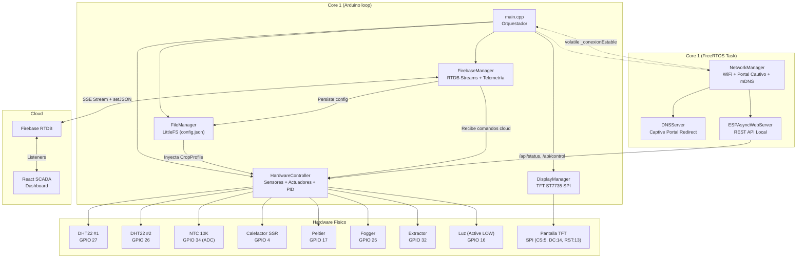

# 🔬 AUDITORÍA INTEGRAL — AgriEdge OS / Cámara Fungi Inteligente

> **Fecha:** 14 de Agosto de 2026  
> **Auditor:** Arquitecto de Software IoT Senior (AgroTech / Firmware Embebido / Lean Startup)  
> **Versión del Firmware:** v1.0.0 (Post-MVP)  
> **Archivos Analizados:** 12 archivos C++, 1 `platformio.ini`, 1 `.gitignore`, 74 informes históricos

---

## 📊 Scorecard Ejecutivo

| Área Auditada | Puntuación | Estado | Justificación Resumida |
| :--- | :---: | :---: | :--- |
| **Algoritmo de Control** | **6/10** | 🟡 | PID implementado pero desacoplado del ciclo; falta histéresis, árbitro de conflictos, y VPD no se usa en decisiones |
| **Arquitectura Agnóstica** | **9/10** | 🟢 | Desacoplamiento ejemplar. `config.json` con CropProfile inyectable. Cero reglas biológicas hardcodeadas en C++ |
| **Conectividad y Failsafe** | **8/10** | 🟢 | Portal Cautivo completo, Rescue AP, loop no-bloqueante. Falta backoff exponencial en Firebase y teardown OTA |
| **Memoria y Rendimiento** | **6/10** | 🟡 | Flash al 91.6% (165 KB libres). `DynamicJsonDocument` genera fragmentación. Librería huérfana `Ticker` |
| **Seguridad** | **5/10** | 🔴 | `Secrets.h` fue commiteado al historial Git. Password OTA hardcodeada. Sin watchdog de hardware activo |
| **Madurez Lean (MVP)** | **8/10** | 🟢 | MVP funcional en producción. 74 informes de sprint documentados. Hipótesis de valor validada |
| **PROMEDIO GENERAL** | **7.0/10** | 🟡 | **Producto sólido con deuda técnica gestionable. Priorizar seguridad y estabilidad del algoritmo** |

---

## 1. 🧠 Auditoría del Algoritmo de Control (El Cerebro)

### 1.1 Control PID — Time-Proportioning

El controlador PID está implementado con la librería `PID_v1` de Brett Beauregard para el calefactor (SSR):

| Parámetro | Valor | Archivo |
| :--- | :--- | :--- |
| $K_p$ | `2.0` | [`HardwareController.cpp:3`](file:///c:/Users/lagos/PROYECTOS/ESP32Proyecto%20-%20Industrial/monitor-iot-backend/proyecto-iot-code-workspace/edge_esp32/src/HardwareController.cpp#L3) |
| $K_i$ | `5.0` | [`HardwareController.cpp:3`](file:///c:/Users/lagos/PROYECTOS/ESP32Proyecto%20-%20Industrial/monitor-iot-backend/proyecto-iot-code-workspace/edge_esp32/src/HardwareController.cpp#L3) |
| $K_d$ | `1.0` | [`HardwareController.cpp:3`](file:///c:/Users/lagos/PROYECTOS/ESP32Proyecto%20-%20Industrial/monitor-iot-backend/proyecto-iot-code-workspace/edge_esp32/src/HardwareController.cpp#L3) |
| Ventana PWM | `5000 ms` (5 s) | [`HardwareController.h:183`](file:///c:/Users/lagos/PROYECTOS/ESP32Proyecto%20-%20Industrial/monitor-iot-backend/proyecto-iot-code-workspace/edge_esp32/src/HardwareController.h#L183) |
| Setpoint | `temp_ideal_min` del CropProfile | [`HardwareController.cpp:265`](file:///c:/Users/lagos/PROYECTOS/ESP32Proyecto%20-%20Industrial/monitor-iot-backend/proyecto-iot-code-workspace/edge_esp32/src/HardwareController.cpp#L265) |

> [!CAUTION]
> **BUG ARQUITECTÓNICO — PID Ineficaz por Desacople Temporal**
> 
> La función `procesarLogicaDeControl()` se invoca cada `INTERVALO_CICLO = 5000 ms` desde [`main.cpp:184`](file:///c:/Users/lagos/PROYECTOS/ESP32Proyecto%20-%20Industrial/monitor-iot-backend/proyecto-iot-code-workspace/edge_esp32/src/main.cpp#L184). La ventana de Time-Proportioning también es de 5000 ms (`PID_WINDOW_SIZE`). Dado que la CPU solo evalúa `req_heater` una vez al inicio de cada ventana, **la modulación intraciclo es imposible**: el relé se comporta como ON/OFF binario cada 5 s, no como PWM proporcional. La solución es desacoplar el PID a una tarea FreeRTOS independiente evaluada cada 50-100 ms.

### 1.2 Histéresis

> [!WARNING]
> **NO EXISTE HISTÉRESIS EXPLÍCITA (Banda Muerta) en ningún actuador On/Off.**

En [`HardwareController.cpp:277-316`](file:///c:/Users/lagos/PROYECTOS/ESP32Proyecto%20-%20Industrial/monitor-iot-backend/proyecto-iot-code-workspace/edge_esp32/src/HardwareController.cpp#L277-L316):
- **Fogger:** Enciende en `hum <= hum_ideal_min`, apaga en `hum > hum_ideal_min` (umbral idéntico, $\Delta = 0$).
- **Extractor por humedad:** Enciende en `hum >= hum_ideal_max`, apaga en `hum < hum_ideal_max`.
- **Cooler/Extractor por temperatura:** Enciende en `temp >= temp_ideal_max`, apaga al cruzar el umbral.

La estabilidad depende del filtro EWMA ($\alpha = 0.1$) y del Anti-Short-Cycle de 3 minutos. El Peltier pasa `ignorarFiltro = true` en línea 333, quedando **sin protección anti-cycling**.

### 1.3 Manejo de Errores de Sensores

La fusión sensorial de redundancia dual es sólida ([`HardwareController.cpp:125-137`](file:///c:/Users/lagos/PROYECTOS/ESP32Proyecto%20-%20Industrial/monitor-iot-backend/proyecto-iot-code-workspace/edge_esp32/src/HardwareController.cpp#L125-L137)):
- Si ambos DHTs son válidos → promedio.
- Si uno falla → se usa el superviviente.
- Si ambos fallan → `tempPromedio = -999.0f`.

> [!CAUTION]
> **BUG CRÍTICO — Safe Mode Inalcanzable ante Falla Total de Sensores**
> 
> Cuando ambos DHTs fallan, `tempPromedio = -999.0f`. Pero el filtro EWMA en línea 167 **omite la actualización** cuando detecta `-999.0f`, congelando `ewma_temp` en su último valor válido (ej. 23.4°C). La condición de Safe Mode en línea 247 evalúa `if (tempActual == -999.0f)`, pero `tempActual = ewma_temp` (que vale 23.4°C, no -999.0f). **El sistema nunca entra en Safe Mode y opera a ciegas con temperatura congelada.**

### 1.4 Conflictos de Actuadores

| Escenario | Resultado | Impacto |
| :--- | :--- | :--- |
| **Emergencia Térmica** (`temp >= temp_crit_max`) | Extractor + Cooler ON, Fogger **BLOQUEADO** | ✅ Correcto — Prioridad absoluta a extracción |
| **Demanda Normal de Frío** (`temp >= temp_ideal_max`) + **Humedad Baja** (`hum <= hum_ideal_min`) | Extractor ON + Fogger ON **simultáneamente** | 🔴 **CONFLICTO** — El extractor evacúa la niebla del fogger |
| **Demanda de Calor** (`temp <= temp_ideal_min`) + **Humedad Alta** (`hum >= hum_ideal_max`) | Heater ON + Extractor ON **simultáneamente** | ⚠️ El extractor evacúa el aire caliente |

### 1.5 Fórmula NTC

La implementación usa la **Ecuación Beta** (no Steinhart-Hart como dice el comentario en [`HardwareController.h:32`](file:///c:/Users/lagos/PROYECTOS/ESP32Proyecto%20-%20Industrial/monitor-iot-backend/proyecto-iot-code-workspace/edge_esp32/src/HardwareController.h#L32)):

$$\frac{1}{T} = \frac{1}{T_0} + \frac{1}{\beta} \ln\left(\frac{R}{R_0}\right)$$

Parámetros ($R_0 = 10\text{k}\Omega$, $\beta = 3950\text{K}$, $T_0 = 25°\text{C}$) son correctos para un NTC 10K B3950. Sin embargo, el ADC del ESP32 no usa calibración (`esp_adc_cal`) ni multisampling, generando un error de $\pm 1.5°\text{C}$ a $\pm 3°\text{C}$.

### 1.6 VPD — Calculado pero Ignorado

El sistema calcula el VPD correctamente con la ecuación de Tetens en [`HardwareController.cpp:181-185`](file:///c:/Users/lagos/PROYECTOS/ESP32Proyecto%20-%20Industrial/monitor-iot-backend/proyecto-iot-code-workspace/edge_esp32/src/HardwareController.cpp#L181-L185), **pero nunca lo utiliza para tomar decisiones de control**. El control se basa exclusivamente en temperatura y humedad por separado.

---

## 2. 🏗️ Auditoría de Arquitectura Agnóstica

### 2.1 Desacoplamiento del `config.json`

**Veredicto: EXCELENTE (9/10).** El firmware es 100% agnóstico. Los parámetros del CropProfile en [`FileManager.h:31-62`](file:///c:/Users/lagos/PROYECTOS/ESP32Proyecto%20-%20Industrial/monitor-iot-backend/proyecto-iot-code-workspace/edge_esp32/src/FileManager.h#L31-L62) definen:

| Campo | Ejemplo Fungi | Ejemplo Invernadero |
| :--- | :--- | :--- |
| `kingdom` | `"FUNGI"` | `"PLANTAE"` |
| `temp_ideal_min` / `max` | 18.0 / 24.0 °C | 22.0 / 30.0 °C |
| `hum_ideal_min` / `max` | 85.0 / 95.0 % | 50.0 / 70.0 % |
| `co2_ideal_min` / `max` | 400 / 800 ppm | 400 / 1200 ppm |
| `light_hours_on` | 12 h | 18 h |

Cambiar de Fungi a Invernadero **no requiere recompilar C++**. Se envía un nuevo JSON vía Firebase RTDB al path `/devices/{deviceId}/commands/crop` y el ESP32 lo deserializa, persiste en LittleFS y aplica inmediatamente.

### 2.2 Cascada de Fallback de `config.json`

1. Archivo no existe → `_crearConfiguracionPorDefecto()` genera perfil Fungi seguro.
2. Error al abrir archivo → retorna la configuración cargada en memoria.
3. JSON corrupto/truncado → `deserializeJson` falla → regenera defaults.
4. Campos faltantes → ArduinoJson usa operador coalescente `|` con valor seguro.

### 2.3 Diagrama de Componentes



---

## 3. 🔌 Auditoría de Conectividad y Failsafe

### 3.1 Portal Cautivo (Plug & Play)

**Veredicto: FUNCIONAL Y COMPLETO.** El flujo es:
1. Sin credenciales WiFi → SoftAP `SCADA_Node_XXXX` abierto.
2. DNS wildcard (`*` → `192.168.4.1`) intercepta probes de Android (`/generate_204`), iOS y Windows (`onNotFound` → 302).
3. Página HTML embebida en `PROGMEM` con pestañas de Control Local y Configuración WiFi.
4. `POST /guardar` → NVS `Preferences` → reboot limpio con `vTaskDelay(1000)` antes de `ESP.restart()`.

### 3.2 Modo Supervivencia (Edge Computing)

**Veredicto: ROBUSTO.** El `loop()` en [`main.cpp:184-202`](file:///c:/Users/lagos/PROYECTOS/ESP32Proyecto%20-%20Industrial/monitor-iot-backend/proyecto-iot-code-workspace/edge_esp32/src/main.cpp#L184-L202) ejecuta incondicionalmente:
- `hw.leerSensores()` → siempre.
- `hw.procesarLogicaDeControl()` → siempre.
- `display.render()` → siempre.
- `firebase.publicarTelemetria()` → solo si `net.estaConectado()`.

La red corre en un FreeRTOS Task dedicado (`Tarea_Red_Fungi`, Stack 8192B, Core 1, Priority 1). Si WiFi falla >60s, levanta un **Rescue AP** (`Fungi_Rescate_XXXX`) automáticamente.

### 3.3 Firebase

- **Autenticación:** Email/Password vía REST Auth (válida pero con credenciales en texto plano).
- **Streams:** SSE bidireccional en `/devices/{deviceId}/commands`. Feedback instantáneo vía `_forzarTelemetria`.
- **Sin Backoff Exponencial:** La variable `_ultimoIntento` en [`FirebaseManager.h:64`](file:///c:/Users/lagos/PROYECTOS/ESP32Proyecto%20-%20Industrial/monitor-iot-backend/proyecto-iot-code-workspace/edge_esp32/src/FirebaseManager.h#L64) está declarada pero **nunca se usa**. Cada `loop()` reintenta `Firebase.ready()` sin delay.

### 3.4 OTA — Causa Raíz del Bug "100% + Timeout"

En [`main.cpp:152-156`](file:///c:/Users/lagos/PROYECTOS/ESP32Proyecto%20-%20Industrial/monitor-iot-backend/proyecto-iot-code-workspace/edge_esp32/src/main.cpp#L152-L156), el callback `onStart` **no detiene Firebase ni el WebServer**:
```cpp
ArduinoOTA.onStart([]() {
    Serial.println(F("[OTA] Inicio de flash..."));
    // ❌ Falta: firebase.end(), servidor.end(), dnsServer.stop()
});
```
Durante el flash, Firebase SSE, mbedTLS y ESPAsyncWebServer siguen consumiendo heap. Al llegar al 100%, la verificación de checksum y el swap de partición SPI compiten con el tráfico de red, causando timeout del ACK final.

---

## 4. 💾 Auditoría de Memoria y Rendimiento

### 4.1 Flash — ¿Cabe OTA?

| Métrica | Valor |
| :--- | :--- |
| Partición `app0` / `app1` | **1,966,080 bytes** (1.875 MiB) cada una |
| Binario actual (91.6%) | **~1,800,929 bytes** (1.717 MiB) |
| Margen restante | **~165,151 bytes** (161 KB, 8.4%) |

**Respuesta: SÍ, OTA es físicamente posible** — el binario cabe en `app1`. Pero con solo 161 KB libres, cualquier nueva librería significativa causará desbordamiento. Agregar `build_flags = -DCORE_DEBUG_LEVEL=0` y eliminar `Ticker` recuperaría espacio.

### 4.2 Librería Huérfana

`sstaub/Ticker @ ^4.4.0` en [`platformio.ini:9`](file:///c:/Users/lagos/PROYECTOS/ESP32Proyecto%20-%20Industrial/monitor-iot-backend/proyecto-iot-code-workspace/edge_esp32/platformio.ini#L9) **no se importa en ningún archivo fuente**. Es peso muerto compilado.

### 4.3 Fragmentación de Heap

| Fuente de Riesgo | Archivo | Tipo |
| :--- | :--- | :--- |
| `DynamicJsonDocument doc(1024)` | [`FirebaseManager.cpp:285`](file:///c:/Users/lagos/PROYECTOS/ESP32Proyecto%20-%20Industrial/monitor-iot-backend/proyecto-iot-code-workspace/edge_esp32/src/FirebaseManager.cpp#L285) | malloc/free por cada stream event |
| `DynamicJsonDocument doc(2048)` ×3 | [`FileManager.cpp:31,117,165`](file:///c:/Users/lagos/PROYECTOS/ESP32Proyecto%20-%20Industrial/monitor-iot-backend/proyecto-iot-code-workspace/edge_esp32/src/FileManager.cpp#L31) | malloc/free por cada operación de config |
| `String` concatenations | `FirebaseManager.cpp`, `NetworkManager.cpp` | Fragmentación por realocación dinámica |

### 4.4 Código Bloqueante

- **`delay()` en todo el proyecto: 0 llamadas.** ✅
- **`vTaskDelay()` en FreeRTOS: Solo en `NetworkManager`** (red en su propio hilo). ✅
- **Riesgo:** `Firebase.setJSON()` y `Firebase.pushJSON()` son llamadas HTTP síncronas TLS que pueden bloquear `loop()` durante cientos de ms bajo packet loss.

---

## 5. 🔒 Auditoría de Seguridad

| Hallazgo | Severidad | Estado |
| :--- | :--- | :--- |
| `Secrets.h` en `.gitignore` del workspace | — | ✅ Incluido en línea 9 |
| `Secrets.h` **commiteado en historial Git previo** | 🔴 CRÍTICA | Credenciales de Firebase (API Key, Email, Password) expuestas en commits anteriores según informes de auditoría internos |
| Password OTA hardcodeada (`agriedge2026`) | ⚠️ MEDIA | En [`main.cpp:151`](file:///c:/Users/lagos/PROYECTOS/ESP32Proyecto%20-%20Industrial/monitor-iot-backend/proyecto-iot-code-workspace/edge_esp32/src/main.cpp#L151) y [`platformio.ini:23`](file:///c:/Users/lagos/PROYECTOS/ESP32Proyecto%20-%20Industrial/monitor-iot-backend/proyecto-iot-code-workspace/edge_esp32/platformio.ini#L23) |
| Watchdog de Hardware (`esp_task_wdt`) | 🔴 CRÍTICA | Campo `watchdog_timeout_ms = 10000` existe en config.json pero **NO está conectado a la API del ESP32** |
| WiFi credenciales | — | ✅ En NVS dinámico vía Portal Cautivo |

---

## 6. 📉 Auditoría Lean Startup

### 6.1 Hipótesis de Valor
> *"Un cultivador de hongos puede controlar automáticamente el microclima de su cámara de fructificación desde cualquier lugar del mundo, sin conocimientos técnicos, con un dispositivo que se configura solo (Plug & Play) y sobrevive cortes de internet."*

**Estado: VALIDADA.** El sistema opera en producción real controlando temperatura, humedad, ventilación e iluminación de forma autónoma.

### 6.2 Waste (Desperdicio)
| Elemento | Veredicto |
| :--- | :--- |
| Librería `Ticker` | ❌ Eliminar — peso muerto |
| Campo `co2_ppm` hardcodeado a 400 | ⚠️ Aceptable como placeholder, pero no debería mostrarse como dato "real" en el dashboard |
| Display TFT ST7735 (160×128) | ✅ Útil para diagnóstico local sin WiFi. No es sobre-ingeniería |
| 74 informes de sprint | ⚠️ Documentación exhaustiva pero el volumen genera ruido. Consolidar en un solo "Engineering Journal" |

### 6.3 Readiness para Beta
¿Podría un cultivador de hongos real usar esto hoy?

**Sí, con reservas:**
- ✅ Plug & Play funcional (Portal Cautivo).
- ✅ Control autónomo offline.
- ✅ Dashboard SCADA profesional.
- ❌ Si ambos DHTs fallan, el sistema **no entra en Safe Mode** (bug crítico).
- ❌ No hay notificaciones push — el operario debe mirar el dashboard.
- ❌ Credenciales expuestas en historial Git (riesgo si el repo es público).

### 6.4 Veredicto: ¿Perseverar o Pivotar?

**PERSEVERAR.** La arquitectura agnóstica es la pieza más valiosa del proyecto. El firmware está fundamentalmente bien diseñado: loop no-bloqueante, FreeRTOS para red, inyección de dependencias, failsafes de cascada. Los problemas encontrados son deuda técnica corregible, no defectos arquitectónicos. La base es sólida para escalar a múltiples verticales (Fungi → Plantae → Cannabis → Acuaponía).

---

## 📋 Tabla de Deuda Técnica

| # | Problema | Archivo / Función | Severidad | Impacto si no se corrige |
| :--- | :--- | :--- | :---: | :--- |
| 1 | **Safe Mode inalcanzable** — EWMA congela temp al fallar ambos DHTs | [`HardwareController.cpp:167,247`](file:///c:/Users/lagos/PROYECTOS/ESP32Proyecto%20-%20Industrial/monitor-iot-backend/proyecto-iot-code-workspace/edge_esp32/src/HardwareController.cpp#L167) | 🔴 | Calefactor opera a ciegas indefinidamente. Riesgo de incendio/daño al cultivo |
| 2 | **Credenciales en historial Git** — Secrets.h fue commiteado | `.git` history | 🔴 | API Key y password de Firebase expuestas públicamente |
| 3 | **Watchdog inactivo** — Config existe pero `esp_task_wdt` no se inicializa | [`main.cpp`](file:///c:/Users/lagos/PROYECTOS/ESP32Proyecto%20-%20Industrial/monitor-iot-backend/proyecto-iot-code-workspace/edge_esp32/src/main.cpp) | 🔴 | Si `loop()` se bloquea (SSL deadlock), el ESP32 no se reinicia jamás |
| 4 | **PID desacoplado del ciclo** — Ventana PWM = Intervalo de evaluación | [`HardwareController.cpp:264-271`](file:///c:/Users/lagos/PROYECTOS/ESP32Proyecto%20-%20Industrial/monitor-iot-backend/proyecto-iot-code-workspace/edge_esp32/src/HardwareController.cpp#L264) + [`main.cpp:70`](file:///c:/Users/lagos/PROYECTOS/ESP32Proyecto%20-%20Industrial/monitor-iot-backend/proyecto-iot-code-workspace/edge_esp32/src/main.cpp#L70) | 🟡 | PID degrada a On/Off binario. Sin modulación térmica real |
| 5 | **Conflicto Extractor ↔ Fogger** — Sin árbitro de actuadores | [`HardwareController.cpp:291-311`](file:///c:/Users/lagos/PROYECTOS/ESP32Proyecto%20-%20Industrial/monitor-iot-backend/proyecto-iot-code-workspace/edge_esp32/src/HardwareController.cpp#L291) | 🟡 | Desperdicio energético e hídrico al operar en contradicción |
| 6 | **Sin histéresis** — Umbrales simétricos sin banda muerta | [`HardwareController.cpp:277-316`](file:///c:/Users/lagos/PROYECTOS/ESP32Proyecto%20-%20Industrial/monitor-iot-backend/proyecto-iot-code-workspace/edge_esp32/src/HardwareController.cpp#L277) | 🟡 | Relay chatter mitigado solo por EWMA y anti-short-cycle |
| 7 | **Peltier sin anti-short-cycle** — `ignorarFiltro = true` | [`HardwareController.cpp:333`](file:///c:/Users/lagos/PROYECTOS/ESP32Proyecto%20-%20Industrial/monitor-iot-backend/proyecto-iot-code-workspace/edge_esp32/src/HardwareController.cpp#L333) | 🟡 | Conmutaciones rápidas degradan vida útil del módulo Peltier |
| 8 | **OTA falla al 100%** — `onStart` no detiene Firebase/WebServer | [`main.cpp:154-156`](file:///c:/Users/lagos/PROYECTOS/ESP32Proyecto%20-%20Industrial/monitor-iot-backend/proyecto-iot-code-workspace/edge_esp32/src/main.cpp#L154) | 🟡 | No se puede actualizar firmware vía WiFi. Requiere cable USB |
| 9 | **Sin backoff exponencial** — Firebase reintenta sin pausa | [`FirebaseManager.cpp:39-57`](file:///c:/Users/lagos/PROYECTOS/ESP32Proyecto%20-%20Industrial/monitor-iot-backend/proyecto-iot-code-workspace/edge_esp32/src/FirebaseManager.cpp#L39) | 🟡 | Flood de conexiones TLS fallidas satura CPU/heap |
| 10 | **`DynamicJsonDocument`** — Fragmentación de heap | [`FirebaseManager.cpp:285`](file:///c:/Users/lagos/PROYECTOS/ESP32Proyecto%20-%20Industrial/monitor-iot-backend/proyecto-iot-code-workspace/edge_esp32/src/FirebaseManager.cpp#L285), [`FileManager.cpp:31,117,165`](file:///c:/Users/lagos/PROYECTOS/ESP32Proyecto%20-%20Industrial/monitor-iot-backend/proyecto-iot-code-workspace/edge_esp32/src/FileManager.cpp#L31) | 🟡 | Crash por heap exhaustion en uptimes de semanas/meses |
| 11 | **ADC sin calibración** — Error $\pm 1.5°\text{C}$ a $\pm 3°\text{C}$ en NTC | [`HardwareController.cpp:114-119`](file:///c:/Users/lagos/PROYECTOS/ESP32Proyecto%20-%20Industrial/monitor-iot-backend/proyecto-iot-code-workspace/edge_esp32/src/HardwareController.cpp#L114) | 🟡 | Lectura de temperatura de sustrato imprecisa |
| 12 | **CO2 hardcodeado** — 400 ppm fijo sin sensor | [`HardwareController.cpp:146-147`](file:///c:/Users/lagos/PROYECTOS/ESP32Proyecto%20-%20Industrial/monitor-iot-backend/proyecto-iot-code-workspace/edge_esp32/src/HardwareController.cpp#L146) | 🟡 | Dashboard muestra dato falso como si fuera real |
| 13 | **VPD calculado pero no usado** — Sin control basado en VPD | [`HardwareController.cpp:181-185`](file:///c:/Users/lagos/PROYECTOS/ESP32Proyecto%20-%20Industrial/monitor-iot-backend/proyecto-iot-code-workspace/edge_esp32/src/HardwareController.cpp#L181) | 🟢 | Oportunidad perdida de control avanzado de clase mundial |
| 14 | **Escritura no atómica en LittleFS** — Sin `.tmp` + rename | [`FileManager.cpp:147-159`](file:///c:/Users/lagos/PROYECTOS/ESP32Proyecto%20-%20Industrial/monitor-iot-backend/proyecto-iot-code-workspace/edge_esp32/src/FileManager.cpp#L147) | 🟢 | Corte de energía durante write → config.json corrupto → fallback a defaults |
| 15 | **Pantalla TFT con `fillScreen(BLACK)`** — Sin dirty checking | [`DisplayManager.cpp:44`](file:///c:/Users/lagos/PROYECTOS/ESP32Proyecto%20-%20Industrial/monitor-iot-backend/proyecto-iot-code-workspace/edge_esp32/src/DisplayManager.cpp#L44) | 🟢 | Parpadeo visual cada 5 s (estético, no funcional) |
| 16 | **Librería `Ticker` huérfana** — No se usa en ningún archivo | [`platformio.ini:9`](file:///c:/Users/lagos/PROYECTOS/ESP32Proyecto%20-%20Industrial/monitor-iot-backend/proyecto-iot-code-workspace/edge_esp32/platformio.ini#L9) | 🟢 | Peso muerto en flash (~varios KB desperdiciados) |
| 17 | **Magic Numbers** — PID gains, -999.0f, coeficientes Tetens | Múltiples archivos | 🟢 | Mantenibilidad reducida; nuevos desarrolladores no entienden valores |
| 18 | **Password OTA hardcodeada** | [`main.cpp:151`](file:///c:/Users/lagos/PROYECTOS/ESP32Proyecto%20-%20Industrial/monitor-iot-backend/proyecto-iot-code-workspace/edge_esp32/src/main.cpp#L151) | 🟢 | Riesgo bajo si red WiFi es privada; extraer a `Secrets.h` idealmente |

---

## 🚀 Plan de Acción Priorizado

### 🔴 Sprint Inmediato — Deuda Crítica (Bloquea todo lo demás)

| # | Tarea | Archivos | Esfuerzo |
| :--- | :--- | :--- | :--- |
| 1 | **Corregir bug de Safe Mode:** Cuando ambos DHTs fallen, marcar `ewma_temp` como inválido (`-999.0f` explícitamente o flag booleano) para que la condición de Safe Mode se active y apague todos los actuadores determinísticamente | `HardwareController.cpp` | ~2h |
| 2 | **Activar Watchdog de Hardware:** Conectar `failsafes.watchdog_timeout_ms` a `esp_task_wdt_init()` + `esp_task_wdt_add()` en `setup()` y `esp_task_wdt_reset()` en cada iteración de `loop()` | `main.cpp` | ~1h |
| 3 | **Rotar credenciales de Firebase:** Si el repo fue público en algún momento, regenerar API Key y cambiar password de la cuenta de servicio. Ejecutar `git filter-branch` o BFG Repo-Cleaner para purgar `Secrets.h` del historial | `.git`, Firebase Console | ~2h |

---

### 🟡 Sprint Siguiente — Core MVP Estable

| # | Tarea | Archivos | Esfuerzo |
| :--- | :--- | :--- | :--- |
| 4 | **Desacoplar PID a tarea FreeRTOS:** Crear `xTaskCreatePinnedToCore("PID_Task", ...)` evaluando el SSR del calefactor cada 50-100 ms independientemente del ciclo de 5 s | `main.cpp`, `HardwareController.cpp` | ~4h |
| 5 | **Implementar Árbitro de Actuadores:** Matriz de estados mutuamente excluyentes (Extractor + Fogger = prohibido excepto en modo de lavado programado) | `HardwareController.cpp` | ~3h |
| 6 | **Implementar Histéresis paramétrica:** Agregar campos `temp_hysteresis` y `hum_hysteresis` a `CropProfile`. Fogger apaga en `hum_ideal_min + hum_hysteresis` | `FileManager.h`, `HardwareController.cpp` | ~2h |
| 7 | **Fix OTA:** En `ArduinoOTA.onStart()`, detener Firebase stream (`Firebase.endStream()`), detener servidor web, detener DNS | `main.cpp`, `FirebaseManager.cpp` | ~2h |
| 8 | **Migrar a `StaticJsonDocument`** donde sea posible y eliminar librería `Ticker` | `FirebaseManager.cpp`, `FileManager.cpp`, `platformio.ini` | ~2h |

---

### 🟢 Sprint Futuro — Escalabilidad y Comercialización

| # | Tarea | Archivos | Esfuerzo |
| :--- | :--- | :--- | :--- |
| 9 | **Control basado en VPD:** Usar VPD como variable maestra de control en lugar de T y RH por separado, optimizando la transpiración del cultivo | `HardwareController.cpp` | ~6h |
| 10 | **Calibración ADC + Multisampling NTC:** Implementar `esp_adc_cal` y promedio de 16-32 muestras para reducir error a $\pm 0.5°\text{C}$ | `HardwareController.cpp` | ~3h |
| 11 | **Notificaciones Push (FCM / Telegram):** Cloud Function en Firebase que escucha umbrales críticos y despacha alertas al teléfono del operario | Cloud Functions (nuevo), Dashboard React | ~8h |
| 12 | **Crop Steering Dinámico:** Automatizar transiciones graduales de setpoints (ej. bajar 0.5°C/día durante 7 días para simular otoño) | React Dashboard, Firebase RTDB | ~8h |
| 13 | **Sensor CO2 NDIR real:** Integrar SCD30/SCD40/MH-Z19 por I2C/UART reemplazando el valor mockeado de 400 ppm | `HardwareController.cpp/.h` | ~4h |

---

## 🏛️ Veredicto Final

El proyecto AgriEdge OS demuestra una **arquitectura fundamentalmente sólida** para un sistema IoT industrial en AgroTech. El desacoplamiento agnóstico (9/10) es la joya de la corona: un cultivador puede pasar de hongos a tomates sin recompilar una línea de C++. El modo de supervivencia offline (loop no-bloqueante + FreeRTOS) es robusto y el Portal Cautivo Plug & Play es completo.

Los problemas encontrados son **deuda técnica acumulada por la velocidad del MVP**, no defectos de diseño. El hallazgo más grave es el **bug de Safe Mode** (#1): si ambos sensores de temperatura fallan, el calefactor sigue operando con la última lectura congelada indefinidamente. Esto es un riesgo de seguridad física que debe corregirse **antes de entregar cualquier unidad a un usuario real**.

**Primera acción inmediata:** Corregir el bug de Safe Mode en `HardwareController.cpp` (2 horas de trabajo). Es la única corrección que separa a este sistema de ser un producto beta seguro de ser un riesgo de incendio.
